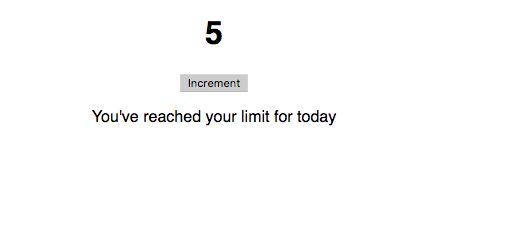

In this tutorial, we are going to learn about how to use __useEffect__ in react apps with examples.


>Note: If you don't know about hooks then check out [What is a hook](/react-hooks/#what-is-a-hook)

## What is the useEffect hook?

>If you are familiar with react lifecycle methods we normally use in class-based components.

In react, **useEffect** hook helps us to use some lifecycle methods in functional components.

They are three lifecycle methods `componentDidMount`, `componentDidUpdate`, and `componentWillUnmount` which we can use them combined in a useEffect hook.

Let's learn the useEffect by using examples.

```js{6-9}
import React, { useEffect, useState } from "react";

function App() {
  const [value, setValue] = useState(0);

 // this function runs when component mounts and component updates
  useEffect(() => {
    document.title = "My app";
  });

  return (
    <div className="App">
      <h1>{value}</h1>
      <button onClick={() => setValue(value+1)}>Increment</button>
    </div>
  );
}
```

In the above code, we imported two hooks which are `useEffect` and `useState`.

>If you don't know about useState hook then checkout my [previous tutorial](/stateful-functional-components-react-hooks/)


The __useEffect__ hook takes the function as an argument and runs this function whenever the component
is mounts to the DOM.

We also added an `increment` button which is used to increment the value and re-renders the dom but whenever the component is re-rendered useEffect re-runs the function we passed as an argument because currently, we activated two lifecycle methods `componentDidMount`, `componentDidUpdate`.

To stop the `componentDidUpdate` lifecycle method we need to pass an empty array`[]` as a second argument to the `useEffect` hook.


```js{6-9}
import React, { useEffect, useState } from "react";

function App() {
  const [value, setValue] = useState(0);

//The function only runs when component mounts to dom
  useEffect(() => {
    document.title = "My app";
  },[]);

  return (
    <div className="App">
      <h1>{value}</h1>
      <button onClick={() => setValue(value+1)}>Increment</button>
    </div>
  );
}
```

Now, we stopped running the function when a component is re-rendered.

Instead of leaving the array empty, we can also pass a conditional value to the array to run the function whenever the given condition is true.


```js{10,14}
function App() {
  const [value, setValue] = useState(0);
  const [active, setActive] = useState(false);

//The function runs when component mounts to dom
  useEffect(
    () => {
      document.title = "My app";
      if (value === 5) {
        setActive(!active);
      }
    },
    // re-run the function when  value === 5
    [value === 5]
  );

  return (
    <div className="App">
      <h1>{value}</h1>
      {/*We only disabled the button when value===5*/}
      <button onClick={() => setValue(value + 1)} disabled={active}>
        Increment
      </button>
      {active && <p>You've reached your limit for today</p>}
    </div>
  );
}
```

In the above code, we passed the conditional `value===5` to the array so that the function runs initially when component mounts to dom and it runs again when the `value` reaches to `5`.




Have you seen in the above image we disabled the button when the value reaches to 5?


### useEffect hook Data Fetching example

we can also use the useEffect for the data fetching in functional components.


```js{8,10,13}
import React, { useState, useEffect } from "react";
import ReactDOM from "react-dom";

const useFetch = url => {
  const [data, setData] = useState(null);

  async function fetchData() {
    const response = await fetch(url);
    const json = await response.json();
    setData(json);
  }

  useEffect(() => {fetchData()},[url]);

  return data;
};

function App() {

  const data = useFetch("https://jsonplaceholder.typicode.com/todos/1");

  if (!data) {
    return <div>Loading...</div>;
  } else {
    return (
      <ul>
        <li>{data.id}</li>
        <li>{data.title}</li>
      </ul>
    )
  }
}

export default App;
```
