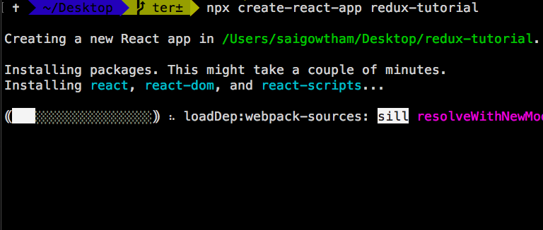
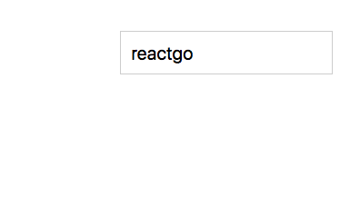
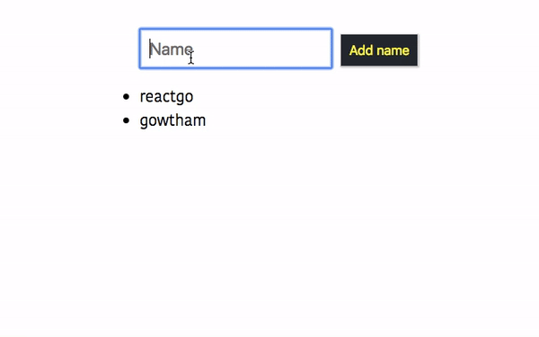
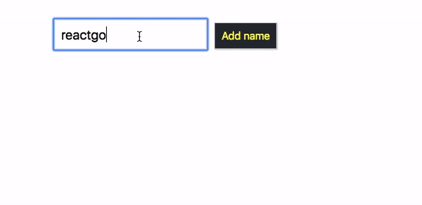

In this tutorial, we are going to learn about how to manage the state in react by using redux and react-redux libraries.

If you want to learn basics about redux then check out previous tutorial [React Redux beginners
tutorial](/react-redux-beginners-tutorial/).


## Getting started

First, we need to install the new react app by using a create-react-app command line tool.

Run the below command to install the `react app`.

```bash
npx create-react-app redux-tutorial
```

This above command will download the react related files in the "redux-tutorial" folder.



Once you successfully installed now change your working directory to app directory by using below
commands.

```bash
cd redux-tutorial
npm start
```

`npm start` command is used turn on the local development server on `localhost:3000`.


>Note: If you stuck anywhere in this tutorial then please checkout code repository on [GitHub](
https://github.com/saigowthamr/redux-tutorial)

## Installing Redux Library

Let's install the `redux` and `react-redux` library by using following commands.

```bash
npm i redux react-redux
```

__redux__ : Redux is used to manage the state

__react-redux__ : It is used to make the bindings between the redux library and react.


Now open your "redux-tutorial" folder by using your favorite code
editor.

### Reducer function

Reducer function is a pure function which takes the previous app state, `type of action` and
returns the next state without mutating the previous state.

Redux follows the immutability it means we are not **mutating** the app state instead of we are returning the
**new app state**.

Redux manages the whole app state in the single JavaScript object.

create a new folder called `reducers` in your `src` directory.

Inside the reducers, folder create a new file called `reducer.js`.

```js{1}:title=reducer.js

const intialState = { name: "reactgo", allNames: []}

const reducer = (state = intialState, action) => {

    if (action.type === "ADDNAME") {
        return {
            allNames: state.allNames.concat(state.name),
            name: ""
        }
    }

    if (action.type === "CHANGE_NAME") {
        return {
            ...state,
            name: action.name
        }
    }

    return state
}

export default reducer;
```

In the above code, we have defined a reducer function with two parameters `state` and `action`.
Inside the reducer function, we have added two conditional statements.

Our initial state object is  `{ name: "", allNames: []}`.

### Connecting React with Redux

Its time to connect our react app with the redux.

Open your `index.js` present inside your  *src* folder.

```js{3,4,8,11-14}:title=index.js
import React from 'react';
import ReactDOM from 'react-dom';
import { createStore } from 'redux'
import { Provider } from 'react-redux';
import App from './App';
import reducer from './reducers/reducer'

const store = createStore(reducer);

ReactDOM.render(
    <Provider store={store}>
        <App />
    </Provider>
    , document.getElementById('root'));
```

Inside the `index.js` file we imported  *createStore* function from the 'redux' library and
`Provider` component from the `react-redux` library.

We invoke the *createStore* function by passing the `reducer` function as an argument and we wrap the
`<Provider>` component with the `<App/>` component by passing a store attribute.

`<Provider>` component uses the react context API to pass the state down through the component tree.


### Accessing the redux state from the components

Now we can access our redux state straight from the React components.


Open your `App.js` file and add the below code.

*mapStatetoProps example*
```js
import React, { Component } from 'react';
import { connect } from 'react-redux'
import './App.css'

class App extends Component {

  render() {
    return (
      <div className="App">

        <div>
          <input type="text"
            placeholder="Name"
            value={this.props.name} />
      </div>
    );
  }
}


const mapStatetoProps = (state) => {
  return {
    name: state.name,
  }
}

export default connect(mapStatetoProps)(App);
```

Here we first imported the Higher-order component called `connect`  from the `react-redux` library
then we defined a `mapStatetoProps` function with the `state` parameter.

**state`parameter**: it helps us to access the redux state which we defined inside the `reducer` function.

Any property we defined inside the `mapStatetoProps` function can available as a props inside the `App` component for example ,In the above component we returned an object with `{name:state.name}` so that we can access the `name` property inside the `App` component as a `this.props.name`.

At last, we need to invoke the `connect` function by passing the `mapStatetoProps` as an argument.


If you open your browser now you can see "reactgo" is displayed inside the `input` field.




### Mutating the Redux state

The redux state tree is only read-only we can't mutate the state directly.

In redux, we can only mutate the state by invoking a `dispatch` method with the type of action.

If you open `reducer.js` file you can see they are two types of actions which are `ADDNAME` and `CHANGE_NAME`.

```js{5,12}:title=reducer.js

const intialState = { name: "reactgo", allNames: []}

const reducer = (state = intialState, action) => {

    if (action.type === "ADDNAME") {
        return {
            allNames: state.allNames.concat(state.name),
            name: ""
        }
    }

    if (action.type === "CHANGE_NAME") {
        return {
            ...state,
            name: action.name
        }
    }

    return state
}

export default reducer;
```
If we invoke the dispatch method with the type `ADDNAME` then we are returning the new state with the
`name` property values are added to the `allNames` array and resetting the `name` property.

Let's see in action.

Open your `App.js` file add the below code.

*mapDispatchtoProps example*

```js:title=App.js
import React, { Component } from 'react';
import { connect } from 'react-redux'
import './App.css'

class App extends Component {


  handleNameChange = (e) => {
    this.props.onChangeName(e.target.value)
  }


  render() {
    return (
      <div className="App">

        <div>
          <input type="text"
            placeholder="Name"
            value={this.props.name} onChange={this.handleNameChange} />

          <button onClick={this.props.onAddName}>Add name</button>

          <ul>
            {this.props.allNames && this.props.allNames.map(name => (
              <li key={name}> {name}</li>
            ))}
          </ul></div>

      </div>
    );
  }
}


const mapStatetoProps = (state) => {
  return {
    name: state.name,
    allNames: state.allNames
  }
}


const mapDispatchtoProps = (dispatch) => {
  return {
    onChangeName: (name) => dispatch({ type: "CHANGE_NAME", name: name }),
    onAddName: () => dispatch({ type: "ADDNAME" }),
  }
}

export default connect(mapStatetoProps, mapDispatchtoProps)(App);
```

In the above, we defined a `mapDispatchtoProps` function where we get the `dispatch` method as a function parameter.

Inside the `mapDispatchtoProps` function we returned a object with two properties `onChangeName` and
`onAddName`

`onChangeName` : it helps us to `dispatch` the action type `CHANGE_NAME` and payload `name` property which is added by the user.

`onAddName`: it helps us to `dispatch` the action type `ADDNAME`.

We can access these two properties inside the `App` component as a `props`.

Let's test it now in the browser.




### Handling the Errors

We can also handle the errors by creating an `ERROR` type inside the reducer function.

Update your `reducer.js` file with below code

```js{5,12,15,19}:title=reducer.js

const intialState = { name: "reactgo", allNames: [], error: "" }

const reducer = (state = intialState, action) => {

    if (action.type === "ADDNAME") {
        return {
            allNames: state.allNames.concat(state.name),
            name: ""
        }
    }

    if (action.type === "CHANGE_NAME") {
        return {
            ...state,
            name: action.name
        }
    }

    if (action.type === "ERROR") {
        return {
            ...state,
            error: action.error
        }
    }

    return state
}
export default reducer;
```

In the above code, we updated our `reducer` function by adding a
a third conditional statement with type `ERROR` and `error` property is added to our
initialState object.


Let's dispatch the action type `ERROR` in our `App` component.

```js{17,49,59,63}:title=App.js
import React, { Component } from 'react';
import { connect } from 'react-redux'
import './App.css'

class App extends Component {


  handleNameChange = (e) => {
    this.props.onChangeName(e.target.value)
  }

  handleClick = () => {

    if (this.props.name) {
      this.props.onAddName()
    } else {
      this.props.onError("Name field cannot be empty")
    }

  }

  render() {
    return (
      <div className="App">

        <div>
          <input type="text"
            placeholder="Name"
            value={this.props.name} onChange={this.handleNameChange} />
          <button onClick={this.handleClick}>Add name</button>

          <p className={this.props.error ? "error active" : "error"}>
          {this.props.error}</p>
          <ul>
            {this.props.allNames && this.props.allNames.map(name => (
              <li key={name}> {name}</li>
            ))}
          </ul></div>

      </div>
    );
  }
}


const mapStatetoProps = (state) => {
  return {
    name: state.name,
    error: state.error,
    allNames: state.allNames
  }
}


const mapDispatchtoProps = (dispatch) => {
  return {
    onChangeName: (name) => dispatch({ type: "CHANGE_NAME", name: name }),
    onAddName: () => dispatch({ type: "ADDNAME" }),
    onError: (err) => dispatch({ type: "ERROR", error: err })
  }
}

export default connect(mapStatetoProps, mapDispatchtoProps)(App);

```


In the above, we added a conditional check inside the `handleClick` method so that whenever the user tries
to click on a `Add name` button without typing the name then we are invoking the **this.props.onError**  method
by passing an error message.

output




### Refactoring the code

It's hard to type the action types in many places manually so that we are a
creating two new files which are `actionCreators.js` and `actionTypes.js`

In `actionTypes.js` file we are defining all our actions types.

Currently, we have three types of actions in our app `CHANGE_NAME` , `ADDNAME` and `ERROR`

Create a `actions` folder in your `src` directory.

Inside the `actions` folder create an `actionTypes.js` file and the below code.

```js:title=actionTypes.js

export const ADDNAME = "ADDNAME";
export const CHANGE_NAME = "CHANGE_NAME";
export const ERROR = "ERROR";

```

create a new file called `actionCreators.js` inside your `actions` folder.

```js:title=actionCreators.js
import { CHANGE_NAME, ADDNAME, ERROR } from './actionTypes'


export function changeName(name) {
    return {
        type: CHANGE_NAME,
        name: name
    }
}

export function addname() {
    return {
        type: ADDNAME
    }
}
export function error(msg) {
    return {
        type: ERROR,
        error: msg
    }
}
```

In the above, we have created three action creators which returning the three different
type of actions.

Action creators are JavaScript functions which return the objects with a type of actions.


Update your `reducer.js` file with `actionTypes`

```js:title=reducer.js

import { CHANGE_NAME, ADDNAME, ERROR } from '../actions/actionTypes'

const intialState = { name: "reactgo", allNames: [], error: "" }

const reducer = (state = intialState, action) => {

    if (action.type === ADDNAME) {
        return {
            allNames: state.allNames.concat(state.name),
            name: ""
        }
    }

    if (action.type === CHANGE_NAME) {
        return {
            ...state,
            name: action.name
        }
    }

    if (action.type === ERROR) {
        return {
            ...state,
            error: action.error
        }
    }

    return state


}
export default reducer;
```

Update the `App.js` file with the action creators.

```title=App.js
import React, { Component } from 'react';
import { connect } from 'react-redux'
import { addname, error, changeName } from './actions/actionCreators'
import './App.css'

class App extends Component {


  handleNameChange = (e) => {
    this.props.onChangeName(e.target.value)
  }

  handleClick = () => {

    if (this.props.name) {
      this.props.onAddName()
    } else {
      this.props.onError("Name field cannot be empty")
    }

  }

  render() {
    return (
      <div className="App">

        <div>
          <input type="text"
            placeholder="Name"
            value={this.props.name} onChange={this.handleNameChange} />
          <button onClick={this.handleClick}>Add name</button>

          <p className={this.props.error ? "error active" : "error"}>{this.props.error}</p>
          <ul>
            {this.props.allNames && this.props.allNames.map(name => (
              <li key={name}> {name}</li>
            ))}
          </ul></div>

      </div>
    );
  }
}


const mapStatetoProps = (state) => {
  return {
    name: state.name,
    error: state.error,
    allNames: state.allNames
  }
}


const mapDispatchtoProps = (dispatch) => {
  return {
    onChangeName: (name) => dispatch(changeName(name)),
    onAddName: () => dispatch(addname()),
    onError: (err) => dispatch(error(err))
  }
}

export default connect(mapStatetoProps, mapDispatchtoProps)(App);
```

Have you seen how our code looks a bit organized?.

---
[Code repository](https://github.com/saigowthamr/redux-tutorial)