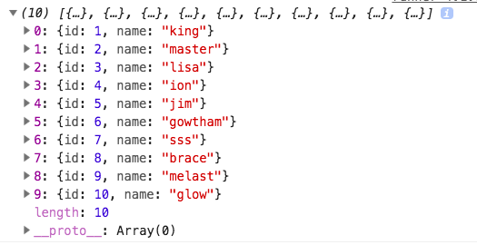

In the last tutorial, we have seen [how to remove duplicate elements from the array](https://jshype.com/javascriptremoveduplicatesfromarray/).


We are using es6 `map` and `filter` methods to remove the duplicate objects from an array.

### Object comparison is done by using the property.

consider we have an array of objects with the `id` and `name` but the same id is repeating twice.

```js
const arr = [
  { id: 1, name: "king" },
  { id: 2, name: "master" },
  { id: 3, name: "lisa" },
  { id: 4, name: "ion" },
  { id: 5, name: "jim" },
  { id: 6, name: "gowtham" },
  { id: 1, name: "jam" },
  { id: 1, name: "lol" },
  { id: 2, name: "kwick" },
  { id: 3, name: "april" },
  { id: 7, name: "sss" },
  { id: 8, name: "brace" },
  { id: 8, name: "peiter" },
  { id: 5, name: "hey" },
  { id: 6, name: "mkl" },
  { id: 9, name: "melast" },
  { id: 9, name: "imlast" },
  { id: 10, name: "glow" }
];
```


### Here is my implementation to remove the duplicate objects from an array.

```js

function getUnique(arr, comp) {

  const unique = arr
       .map(e => e[comp])

     // store the keys of the unique objects
    .map((e, i, final) => final.indexOf(e) === i && i)

    // eliminate the dead keys & store unique objects
    .filter(e => arr[e]).map(e => arr[e]);

   return unique;
}

console.log(getUnique(arr,'id')

```

In the above code, we are using the chaining pattern where the output of the `map` method will be the input of the other `map` method.





###  Codepen demo

<iframe height='265' scrolling='no' title='Remove duplicate objects from array' src='//codepen.io/saigowthamr/embed/LXBYjr/?height=265&theme-id=0&default-tab=js,result' frameborder='no' allowtransparency='true' allowfullscreen='true' style='width: 100%;'>See the Pen <a href='https://codepen.io/saigowthamr/pen/LXBYjr/'>Remove duplicate objects from array</a> by saigowtham (<a href='https://codepen.io/saigowthamr'>@saigowthamr</a>) on <a href='https://codepen.io'>CodePen</a>.
</iframe>

Happy coding...
