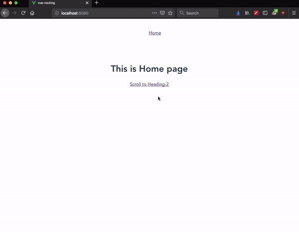

In this tutorial, we are going to learn about scroll to anchor tags within a page in vue router.


In the below example we have added an `id`  `heading-2` to `h2` element.

```html{21}:title=Post.vue
<template>
  <div>
    <h1>Hello vue</h1>
    <p>
      Lorem ipsum dolor sit amet consectetur,
      adipisicing elit. Maiores modi aspernatur natus quo
      veritatis voluptate neque sint quae reprehenderit quidem,
      consequatur quos sunt culpa hic dolor nostrum inventore quod?
      Consequuntur.
    </p>
    <p>
      Where does it come from?
      Contrary to popular belief, Lorem Ipsum is not simply random text. It has roots in a piece of classical Latin literature from 45 BC, making it over 2000 years old. Richard McClintock, a Latin professor at Hampden-Sydney College in Virginia, looked up one of the more obscure Latin words, consectetur, from a Lorem Ipsum passage, and going through the cites of the word in classical literature, discovered the undoubtable source. Lorem Ipsum comes from sections 1.10.32 and 1.10.33 of "de Finibus Bonorum et Malorum" (The Extremes of Good and Evil) by Cicero, written in 45 BC. This book is a treatise on the theory of ethics, very popular during the Renaissance. The first line of Lorem Ipsum, "Lorem ipsum dolor sit amet..",
      comes from a line in section 1.10.32.
    </p>
    <p>
      Where does it come from?
      Contrary to popular belief, Lorem Ipsum is not simply random text. It has roots in a piece of classical Latin literature from 45 BC, making it over 2000 years old. Richard McClintock, a Latin professor at Hampden-Sydney College in Virginia, looked up one of the more obscure Latin words, consectetur, from a Lorem Ipsum passage, and going through the cites of the word in classical literature, discovered the undoubtable source. Lorem Ipsum comes from sections 1.10.32 and 1.10.33 of "de Finibus Bonorum et Malorum" (The Extremes of Good and Evil) by Cicero, written in 45 BC. This book is a treatise on the theory of ethics, very popular during the Renaissance. The first line of Lorem Ipsum, "Lorem ipsum dolor sit amet..",
      comes from a line in section 1.10.32.
    </p>
    <h2 id="heading-2">Second heading</h2>
    <p>
      Where does it come from?
      Contrary to popular belief, Lorem Ipsum is not simply random text. It has roots in a piece of classical Latin literature from 45 BC, making it over 2000 years old. Richard McClintock, a Latin professor at Hampden-Sydney College in Virginia, looked up one of the more obscure Latin words, consectetur, from a Lorem Ipsum passage, and going through the cites of the word in classical literature, discovered the undoubtable source. Lorem Ipsum comes from sections 1.10.32 and 1.10.33 of "de Finibus Bonorum et Malorum" (The Extremes of Good and Evil) by Cicero, written in 45 BC. This book is a treatise on the theory of ethics, very popular during the Renaissance. The first line of Lorem Ipsum, "Lorem ipsum dolor sit amet..",
      comes from a line in section 1.10.32.
    </p>
  </div>
</template>
```
When we try to navigate `/post#heading-2` by default we can't scroll to the anchor tag, Vue router offers us a `scrollBehavior` function by using this we can control the scrolling behavior.

Now in our `main.js` file, we need to add a `scrollBehavior` function.

```js{15-21}:title=main.js
import Vue from 'vue'
import App from './App.vue';
import VueRouter from "vue-router";
import Home from './components/Home.vue';
import Post from './components/Post.vue'

Vue.use(VueRouter);

const router = new VueRouter({
  mode: "history",
  routes: [
    { path: '/', component: Home },
    { path: '/post', component: Post },
  ],
  scrollBehavior: function (to) {
    if (to.hash) {
      return {
        selector: to.hash
      }
    }
  },
})

new Vue({
  router,
  render: h => h(App),
}).$mount('#app')
```

__scrollBehavior__ function accept `to` parameter by using that we are checking is there any `hash` fragment is attached to the route, if a hash fragment is found then we are returning an object with `selector` property.


