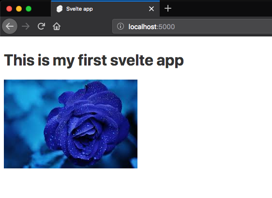

In this tutorial, we are going to learn about how to bind HTML attributes in svelte.


This is our starting code.

```js:title=App.svelte
<script>
  let src = "rose.jpg";
</script>


<h1>This is my first svelte app</h1>

```

To bind the attributes in __svelte__ we need to use curly brace syntax `{ }` so that it can evaluate the JavaScript expression.

```js{6-8}:title=App.svelte
<script>
  let src = "rose.jpg";
</script>

<h1>This is my first svelte app</h1>
 // attribute binding

```



## Shorthand attributes

If the attribute __name__ and __value__ is matched like in above code  `src={src}` it can be replaced by `{src}`.

```html

```

Similarly, we can bind other HTML attributes by using `{ }` curly brace syntax.


```html{7,9}
<script>
   let disabled = true;
   let google = "https://www.google.com"
</script>

//disabled button
<button {disabled}>Click</button>

<a href={google}>Google</a>
```