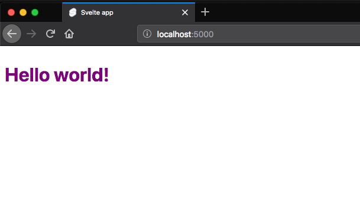
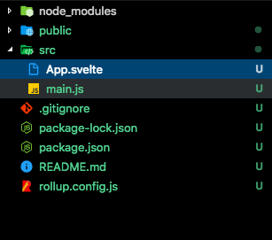

In this tutorial, we are going to learn about a basic introduction to svelte.js.


## What is Svelte ?

Svelte is a javascript framework which is used to build fast web applications. Similar to
[React](/react/tutorial/) or [Vue](/vuejs-intro-tutorial/) but in svelte we don't need any dependencies in runtime like react or vue takes some time to interpret our code it means in svelte we can get pure JavaScript.


## Getting started

Let's create our first svelte app by running the following commands in your terminal.

```bash
npx degit sveltejs/template my-svelte-app && $_
```
This above command will download the svelte app inside `my-svelte-app` folder and change your current working directory to `my-svelte-app`

Now we need to install the dependencies by running the below command.

```bash
npm install
```
Let's run the development server by using the following command.

```bash
npm run dev
```



Now, open your `my-svelte-app` folder in your favorite code editor and navigate to src folder where you can see two files  `main.js` and `App.svelte`.




**main.js :** This is root file which helps us to inject our svelte app into the dom.

```js{4}:title=main.js
import App from './App.svelte';

const app = new App({
    target: document.body,
});

export default app;
```


**App.svelte :** This is root component of the svelte app.
Remove everything inside `App.svelte` file and add the below code.

```js{3,13}:title=App.svelte
<script>
 // JavaScript goes here
  let name = "Hello svelte";
</script>

<style>
   //css goes here
</style>

// markup
<div>
  <h1>This is my first svelte app</h1>
  //interpolation
  <p>{name}</p>
</div>
```

In Svelte each component consists of `script`, `style` and HTML markup.

script: In the script tag, we need to write JavaScript code related to that component

style: In style tag, we need to write CSS code related to that component(styles are scoped by default in svelte).

To interpolate the JavaScript in markup we need to use single curly brace `{name}` in svelte.

We can also write JavaScript methods inside curly brace like `{name.toUpperCase()}`

---

1. [Attribute Binding in Svelte](/attribute-binding-vuejs/)