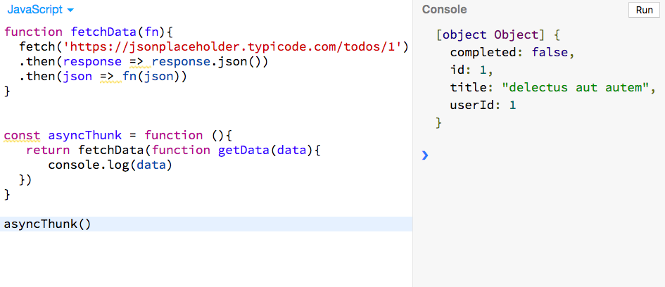
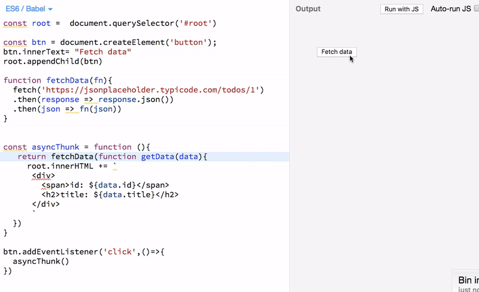

In this tutorial, we will learn about what are thunks and how to use the thunks in our JavaScript code.


### Definition of thunk

A thunk is just a function which delays the evaluation of the value.

The thunk function doesn't take any arguments and gives the value whenever you invoke the thunk.


__Example of synchronous thunk__

```js

function subtract(x,y){
    return x-y;
}

// subtract function is evaluated the
// expression and result is returned immediately
console.log(subtract(5,3)) // 2


// this is a thunk function

// result is delayed untill we call the thunk() function
const thunk = function (){
    return subtract(5,3);
}

// we always get the same data whenever we call the thunk function
console.log(thunk()) // 2

```

In the above code, we first defined the `subtract` function and next we defined `thunk` function which returns the value of `subtract` function.


### Asyncrouchronous thunks

Sometimes we need to make network requests in such case we need to use asynchronous thunks.

If you know about __redux__ state management library which uses the asynchronous thunks to delay the actions to dispatch.


Let's see an example:

```js
function fetchData(fn){
   setTimeout(()=>fn(1),2000)
}


const asyncThunk = function (){
   return fetchData(function(data){
      console.log(data)
  })
}

asyncThunk()

// 1
```

In the above code, we used `setTimeout` function to make our code asynchronous.


### Network requests example using thunks

```js
function fetchData(fn){
  fetch('https://jsonplaceholder.typicode.com/todos/1')
  .then(response => response.json())
  .then(json => fn(json))
}


const asyncThunk = function (){
   return fetchData(function getData(data){
      console.log(data)
  })
}

asyncThunk()

```

In the above code we are not calling the `getData` function immediately we only call the `getData`
function whenever the `data` is available from the API endpoint.





In our case, we just logged the data in the console if you want to render the data in the dom you can do it.


### Rendering data example




In the above example we used `FetchData` button to invoke the `asyncThunk()` function then we render the data in the dom.