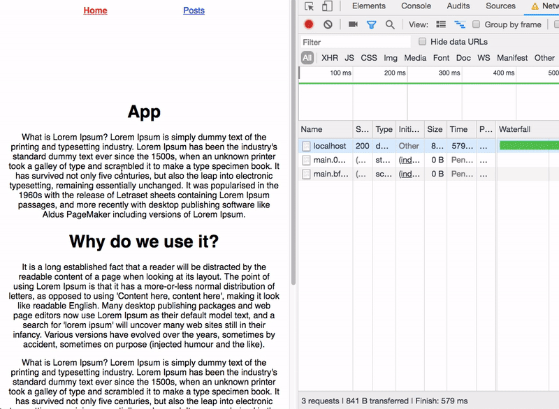

React suspense and React.lazy helps to lazy load the components so that users can only download the required data related to that page.

Let’s see how it works.

### Network requests Without suspense.

```js
import React, { Component } from "react";
import "./App.css";
import axios from "axios";
import Header from './components/header';
import Albums from './components/albums';
class App extends Component {
  state = {
    posts: [],
    show:true
  };
  componentDidMount() {
    axios
      .get(`https://itunes.apple.com/in/rss/topalbums/limit=100/json`)
      .then(res => {
        this.setState({show:false})
        this.setState({ posts: res.data.feed.entry });
      });
  }
  render() {
    const load = <h1 className="load">Loading...</h1>
    const albums = this.state.posts.map(e => {
      return (
        <Albums key={e.id.label} image={e["im:image"][2].label}
            title={e.title.label}
            link={e.id.label}
            price={e["im:price"].label}
            date={e["im:releaseDate"].label}
        />
      );
    });
    return (
      <div className="app">
      <Header/>
      <div className="albums">
        {this.state.show ? load:albums}
        </div>
      </div>
    );
  }
}
export default App;
```

### With suspense
In suspense, we need to specify the fallback property so that suspense can load the fallback property at the time of that component is downloading.

In below code, i specified a fallback property to the loadingGif image.

```js
import React, { Suspense, lazy, Component } from 'react';
import axios from "axios";
import Header from './components/header';
import "./App.css";

// import Albums from './components/albums';

const Albums = lazy(() => import('./components/albums'));

class App extends Component {

  state = {
    posts: [ ],
  };

  componentDidMount() {
    axios
      .get(`https://itunes.apple.com/in/rss/topalbums/limit=100/json`)
      .then(res => {
        this.setState({ posts: res.data.feed.entry });
      });
  }

  render() {

    const loadingImg = <div className="album-img">
      
    </div>

    const albums = this.state.posts.map(e => {
      return (
        <Suspense key={e.id.label} fallback={loadingImg}>
          <Albums
            image={e["im:image"][2].label}
            title={e.title.label}
            link={e.id.label}
            price={e["im:price"].label}
            date={e["im:releaseDate"].label}
          />
        </Suspense>
      );
    });
    return (
      <div className="app">
        <Header />
        <div className="albums">
          {albums}
        </div>
      </div>
    );
  }
}
export default App;

```


### Code splitting in React router by using suspense

In below code, the lazy function takes the dynamic imports and returns the promise which resloves the Component.

```js
import { BrowserRouter as Router, Route, Switch } from 'react-router-dom';
import React, { Suspense, lazy } from 'react';
import Header from './header'
import Loading from './components/Loading'

const Home = lazy(() => import('./components/App'));

const Posts = lazy(() => import('./components/Posts'));

const App = () => (
    <Router>
        <Suspense fallback={<Loading />}>
            <Header />
            <Switch>
                <Route exact path="/" component={Home} />
                <Route path="/posts" component={Posts} />
            </Switch>
        </Suspense>
    </Router>
)
export default App;

```



Happy coding…

[Code Repository](https://github.com/saigowthamr/Itunes-Top-100-albums)
