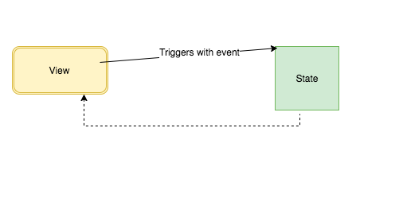

In this tutorial, we are going to learn about two-way data binding in react apps with examples.

## What is two way data binding?

Two data binding means

- The data we changed in the view has updated the state.
- The data in the state has updated the view.





Let's implement the two way binding in react.


```js{4,7-11,17-19}

class UserInput extends React.Component{

  state = {
      name:"reactgo"
  }

  handleChange = (e) =>{
    this.setState({
        name: e.target.value
    })
  }

   render(){
    return(
      <div>
       <h1>{this.state.name}</h1>
       <input type="text"
         onChange={this.handleChange}
         value={this.state.name} />
      </div>
      )
   }
}

```

### Two data binding demo

<iframe height='265' scrolling='no' title='Two data binding react' src='//codepen.io/saigowthamr/embed/romdar/?height=265&theme-id=dark&default-tab=result' frameborder='no' allowtransparency='true' allowfullscreen='true' style='width: 100%;'>See the Pen <a href='https://codepen.io/saigowthamr/pen/romdar/'>Two data binding react</a> by saigowtham (<a href='https://codepen.io/saigowthamr'>@saigowthamr</a>) on <a href='https://codepen.io'>CodePen</a>.
</iframe>


In the above code, we have attached an `onChange` event handler to the input element and also value attribute is connected to the `this.state.name`.so that the value attribute is always synced with `this.state.name` property.

Whenever the user changes an input in the view it triggers the __onChange__ event handler then it calls the this.setState method and updates the `this.state.name` property value at final the `UserInput` component is __re-rendered__ with the updated changes.


This is also called controlled component because the value of an input element is controlled by the react.