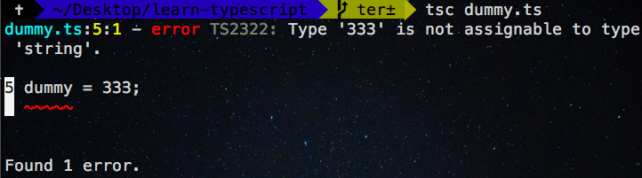
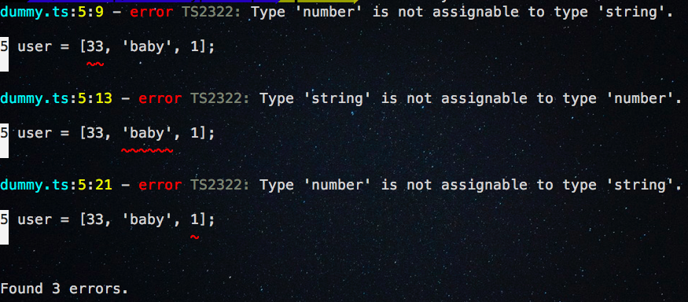

In this tutorial, we are going to learn about what is TypeScript and how to use typescript in our
projects.


## What is TypeScript?

A typescript is a superset of JavaScript where it compiles down into plain JavaScript.


- TypeScript is developed and maintained by Microsoft.

- TypeScript provides us static type checking to our JavaScript code.

- TypeScript gives us user-friendly errors during compile time.

- We can use new JavaScript features and future proposals in TypeScript.


### Getting started

Let's install the typescript compiler by using the node package manager(npm).

Run the following command to install typescript compiler in your computer.

```bash
npm i -g typescript
```
>if you are using a mac then you need to add `sudo` before the command

create a new directory in your machine by running the below commands.

```bash
mkdir learn-typescript
cd learn-typescript
```

Now open `learn-typescript`  folder in your favorite code editor and create a new file called
`dummy.ts`.

>`.ts` is a typescript extension.

### Writing our first TypeScript code

Let's write our first typescript code in our `dummy.ts` file.

```ts:title=dummy.ts
let dummy: string = "Hello Boss";
```
In the above code, we added a type annotation `string` so that `dummy` variable can only allow strings if we try to pass other than `strings` like numbers or arrays TypeScript compiler raise an error.

### Compiling our TypeScript code

Let's compile our TypeScript code by running the below command.

```bash
tsc dummy.ts #tsc : typescript compiler
```
Now you can see a new file called `dummy.js`  is generated by the typescript compiler which contains our pure JavaScript code.

Let's generate our first error by passing the wrong value to the `dummy` variable.

```js{3}:title=dummy.ts
let dummy: string = "Hello Boss";

dummy = 333
```



Have you seen typescript compiler generates an error "333" is not assignable to `string`?


### Type Annotations

Type annotations mean we are taking the contract to variables or functions or objects can only accept particular types if we try to pass the wrong types we will get an error.


They are different types TypeScript provides us most of them have come from JavaScript types.


#### String type

A string is declared by using single quotes(`''`) or doubles quotes(`""`). By using
`string` type we refer to string data type in typescript.

example:

```js
let welcome:string = "welcome to reactgo.com"

// we can also use template strings in TypeScript

let name: string = `Gowtham`;

```

#### Number type

In TypeScript we have floating point numbers like same in JavaScript, these floating point numbers get the type `number`  in TypeScript.

```js
let a: number = 1 ;

```

#### Boolean type

Boolean data type has only two values which are either `true` or `false` in typescript we use type `boolean` to accept boolean values.

```js
let isActive: boolean = true;
```

#### Arrays

In TypeScript, they are two ways to accepts array types.

The first way is `element` type followed by array `[]`.

```js
// fruits variable can only accept an array of string types.

let fruits:string[] = ['apples','apricots','avocados'];

```

In the above code, we have added a `string` type with array`[]` so that `fruits` variable can only accept an array with strings.

The second way uses the generic array type `Array<elementtype>`

```js
let fruits:Array<string> = ['apples','apricots','avocados'];

// numbers variable can only accept array of numbers
let numbers:Array<number> = [1,2,3,4,5,6,7,8];

```

#### Tuple

In TypeScript, we have tuples it means we can only allow a fixed number of element types to the array.

```js
// we declared a tuple
let user:[string,number,string];

// intializing the values
user = ['baby',33,'programming']; // TypeScript is happy now

```
We declared a __tuple__ with three types `string`,`number` and `string` so that we have a fixed length of the array with three types if we try to initialize with wrong types or more than three elements TypeScript will raise an error.

```js
// we declared a tuple
let user:[string,number,string];

// intializing the values
user = ['baby',33,'programming']; // TypeScript is happy now


//re intializing with wrong values
user = [33,'baby',1]; // Error

```
output:



### Any type

Sometimes we are not sure what type of data we can get to the variables in that cases TypeScript provide us an `any` type.

```js

let isActive:any =  false; // boolean

isActive = "Do your work"; // string
```

`any` type usage in arrays.

```ts
let user:any[] = ['1233','king',39,true]
```
In the above we used `any` type because we are not sure exactly what type of data we can get
to `user` array.

### Function types

Let's see how to add types to the functions.

```js

// function with two parameters are number type
function add(a:number,b:number):number{
    return a+b;
}
```
Here we have added `types` to the function parameters and return type `number`.

>we optionally leave return type to the functions because typescript can figure out return type automatically by looking through the return statements of the function.

Let's create a fully typed function because in the above code we have just created a function with types.

```js
let add:(a:number,b:number)=>number;

add = function(a:number,b:number):number{
    return a+b;
 }

add(1,2) //correct

```
In the above code, we exactly specifying what type does `add` function looks like.


### Optional and default parameters in functions

In typescript, every parameter is strictly required if you fail to pass any parameter typescript gives us an error.

To make the function parameters optional we need to add `?` at the end of the parameter.

*optional parameters example*
```js
function welcome(name: string, age?: number): string {
    if (name && age) {
        return `Welcome ${name} and ${age}`
    } else {
        return `Welcome ${name}`
    }
}

welcome('gowtham') // ok

welcome('gowtham',22) // ok

welcome('gowtham',22,'lol') // error Expected 1-2 arguments, but got 3

```
In the above code, we have added `?` at end of the `age` parameter so that it becomes optional.

*default parameter example*

```js
function getLength(arr: number[], length = arr.length) {
    return length
}

getLength([1,2,3,4,5])
```


### Void type

void means the absence of returning any type, for example, a function that doesn't return
any type of value.

```js
function alertHello():void{
    alert('Hello')
}
```
`alertHello` function doesn't return any value.

### Never type

The `never` is a return type of the function, arrow functions which always throws an exception.

> A function that never reaches to the endpoint

```js

// throw an exception
function error(err:string):never{
     throw new Error(err);
}

// while loop never stops
function infinteLoop():never{
   while(true){

   }
}
```

### Interfaces

Interfaces help us to design the particular shape of data.

Let's create an interface now.

```js
interface User {
    name: string
    active: boolean
}

let user: User = {
    name: "gowtham",
    active: true
}
```
In the above code, we have created an interface `User` with two properties where `name`
the property type is `string` and `active` property type is `boolean`.

Now the `user` object should always satisfy the shape of the `interface`.


We can also __extend__ the interfaces by using `extends` keyword.

```js
interface User {
    name: string
    active: boolean
}

// extending the User interface
interface AdminUser extends User {
    id: string
}


let user: User = {
    name: "gowtham",
    active: true
}


// admin object  should have properties
//present in User interface + AdminUser interface
let admin: AdminUser = {
    name: "john",
    active: true,
    id: "3232hejdjdjf"
}
```
Here we created a `AdminUser` interface by extending the `User` interface so that now `admin` object
shape should be combination of `User interface` plus `AdminUser interface`

### Enums

Enums are set of named constants which are created by using `enum` keyword.In TypeScript we have __string__ enums and __numeric__ enums.


**numeric enums**

```js
enum Day {
    Monday,
    Tuesday,
    Wednesday
};

console.log(Day.Monday) // 0
console.log(Day.Tuesday) //1
console.log(Day.Wednesday) //2
```
We have created a `numeric` enum `Day` by default first enumerator should be initialized with value `0`
and auto-incrementing the next enumerators by 1 like `Monday:0`,`Tuesday:1`,`Wednesday:2`.


**string enums**

```js
enum Colors{
     Red = "#FF0000",
     Green= "#008000",
     Blue = "#0000FF"
}

```
In string enums we need to initialize a constant value like in the above code we have created a `Colors` enum with three enumerators.