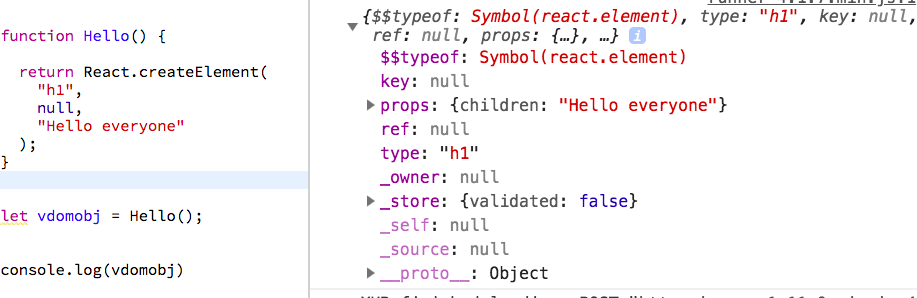

In this tutorial, we are going to learn about why react uses the virtual dom to make the real dom nodes.

If you want to know about JSX then refer to previous tutorial [Learn JSX in more detailed](/learn-react-jsx-detailed/)


First, let’s see how virtual dom look like so that we can have a solid understanding.


### Simple react component

```js

function Hello(){

  return <h1>Hello everyone</h1>

}

```
The jsx we write inside the react will get transformed into React.createElement() method with the help of babel compiler.


The JSX after transpiling through babel.

```js
function Hello() {

  return React.createElement(
    "h1",
    null,
    "Hello everyone"
  );
}
```

Its time to see __virtual dom object__.



The left part of the image is react code and right part is virtual dom object.

If we pass this virtual dom object to the `render()` method it will create real dom elements.


### What is virtual dom ?

- Virtual dom is a object representaion of the UI which helps us to create real dom elements.

- Virtual dom keeps synced with a real dom by the help of react dom library this process is called reconciliation.


Every time we update something in the UI react will create a new virtual dom and compare it with the old virtual dom created during the first time render method called then react figures out, is there any difference between old virtual dom and new virtual dom.if it founds something new then only react updates the ui.

for example:

```js
<button style={{color:"red",padding:"10px"}}>change</button>

```

```js
<button style={{color:"green",padding:"10px"}}>change</button>

```

React compares the above two elements and figures out color need to be updated not the padding on the real dom node.

