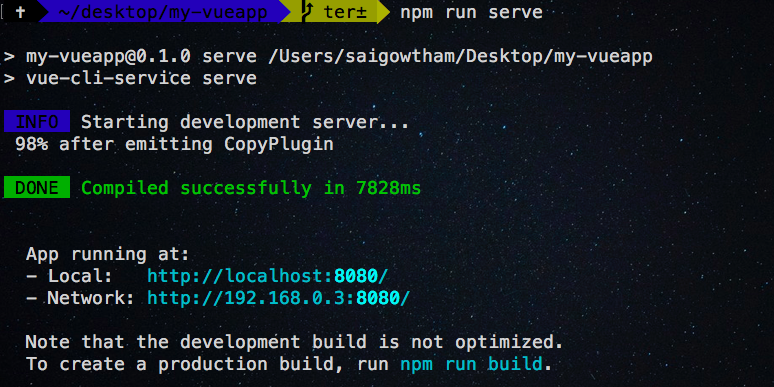
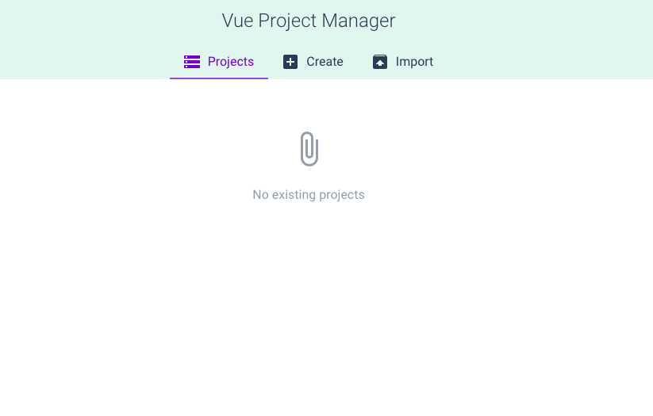
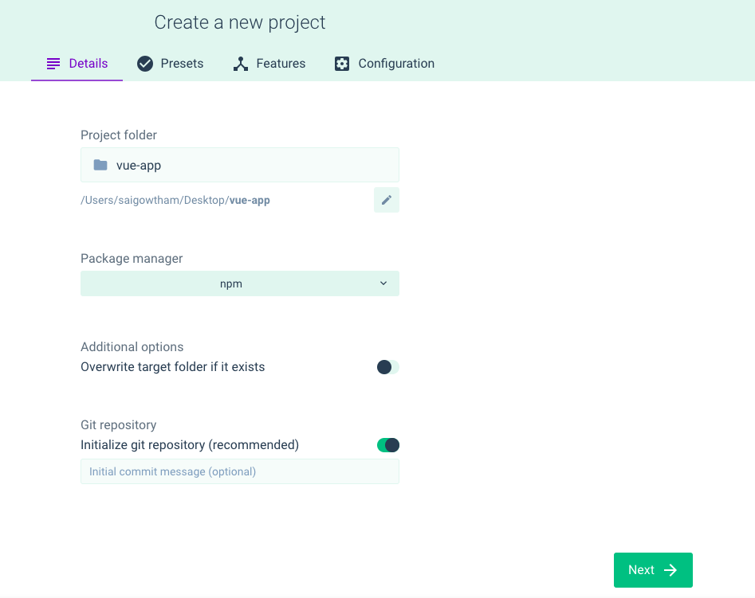
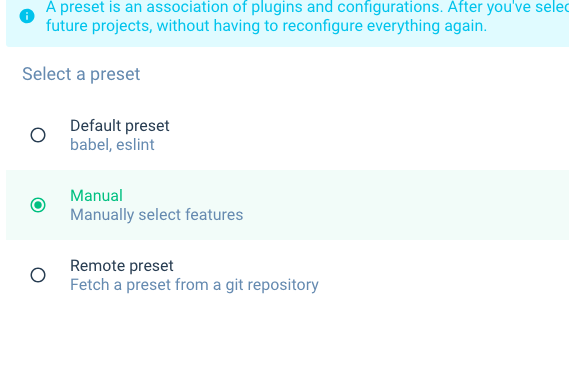
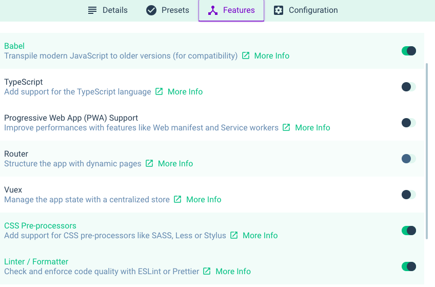
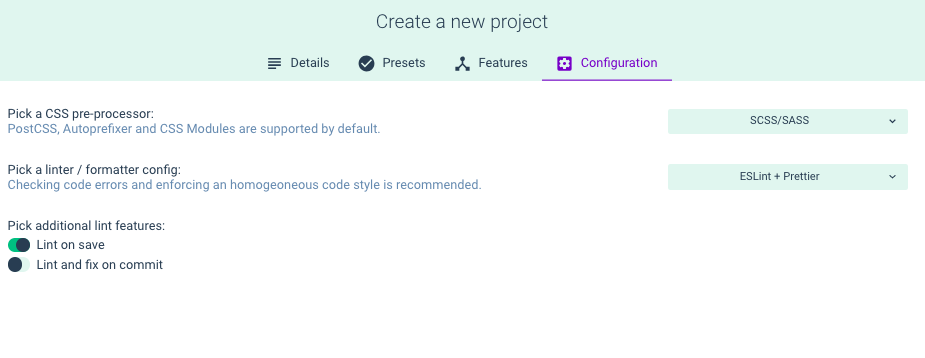
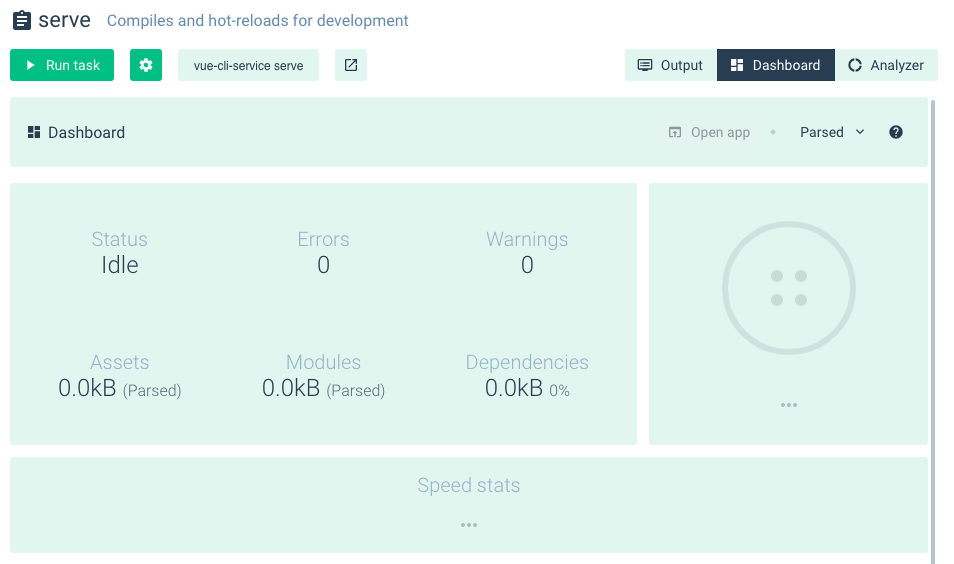
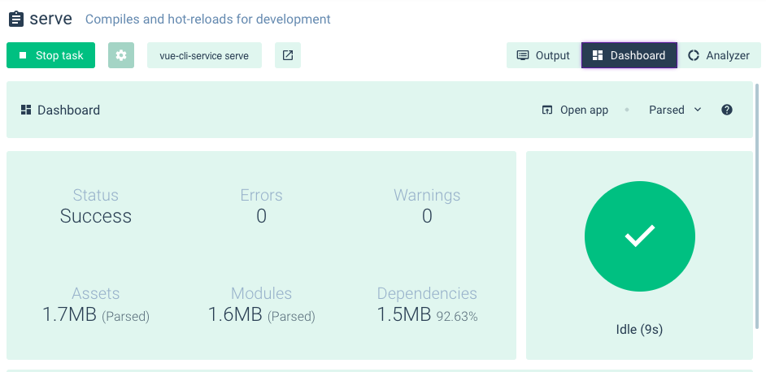
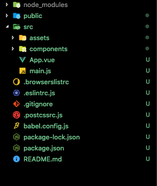
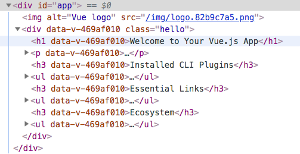

In this tutorial, we are going to learn about how to create a Vue project by using Vue CLI(command line interface) and Vue UI.


Vuejs offers us Command line interface for quickly generating the **vue** projects.


### Installing Vue Cli


Let's install the Vue cli by running the following command in your terminal.

```bash
npm install -g @vue/cli
```

>If you're using a mac then you need to add `sudo` before `npm`.


### Creating Our Vue project

Once you successfully installed vue-cli you will have access to the `vue` binary in your command line.


Let's create our vue project by running below command.

```bash
vue create my-vueapp #vue create folder-name
```

This command will download our project-related files in `my-vueapp` folder.

Once you run this command you will prompt with different questions.

Select the `manually select features ` option by using your down arrow keys and hit enter.
```bash
Vue CLI v3.0.0
? Please pick a preset:
  default (babel, eslint)
❯ Manually select features
```

Now it will prompt with various add-ons to add in our project Use `spacebar` to select  `CSS Pre-processors`  then hit enter.

```bash
? Please pick a preset: Manually select features
? Check the features needed for your project:
 ◉ Babel
 ◯ TypeScript
 ◯ Progressive Web App (PWA) Support
 ◯ Router
 ◯ Vuex
❯◉ CSS Pre-processors
 ◉ Linter / Formatter
 ◯ Unit Testing
 ◯ E2E Testing
```

Now it will ask for choose your CSS pre-processor by using arrow keys to select your favorite preprocessor.

We will go with `SCSS/SASS`.

```bash
? Pick a CSS pre-processor (PostCSS, Autoprefixer
 and CSS Modules are supported by default): (Use arrow keys)
❯ SCSS/SASS
  LESS
  Stylus
```

We will then choose `ESLint+Prettier` option for our project.

```bash
? Pick a linter / formatter config:
  ESLint with error prevention only
  ESLint + Airbnb config
  ESLint + Standard config
❯ ESLint + Prettier
```

Now It will prompt with additional lint features option choose `Lint on save` option and hit enter.

```bash
? Pick additional lint features
> to invert selection)
❯◉ Lint on save
 ◯ Lint and fix on commit
```

Now choose *dedicated config files* option.

```bash
? Where do you prefer placing config for Babel,
PostCSS, ESLint, etc.?
❯ In dedicated config files
  In package.json
```

We will ask for Save this as a preset for future projects enter `N` for this project.

```bash
Save this as a preset for future projects? (y/N): N
```
> Note: if you like to save this options as your preset then type:`Y` so that next time if you're creating a vue project you can choose this preset to generate your vue project fastly.

Once successfully downloaded our project-related files in `my-vueapp`
folder now we need to change our current working directory by using below command.

```bash
cd my-vueapp
```

### Running our Development server

Let's serve our vue project by running our development server.

In your terminal run the following command to start development server.

```bash
npm run serve
```



Now open your browser and enter `localhost:8080` to see our vue app.


### Vue UI

So far we have learned how to create Vue app by using command line interface
now let's create the same vue project by `Vue` graphical user interface.

Open your terminal and run following command to start Vue GUI in your browser.

```bash
vue ui
```


Now click on a __create__ tab and select location to save your app then click on `Create a new project here` button.

Enter your project name and choose your package manager then click on `Next ` button.


We will then choose manually select features option.



Next, we will select the  `preprocessors` option on the `features` tab.




On configurations tab, we select `scss/sass` option by using dropdown and
select `ESlint+prettier` option then click on `Create project` button it will prompt with enter your preset name select *continue without saving* option.




Now click on `Tasks` in your left side navigation and select `serve` option.




Let's click on `Run task` button to start the development server then click on `open app` to open the vue app in your browser.



### Exploring our project

Let's explore our vue project we just created by using cli or Vue ui.

*vue-folder-structure*


**node_modules**: In this folder, we have all required packages to run the vue app.

**src**: In the src folder, our Vue app is stored.

**public**: In this folder, we have an `index.html` file and favicon.

**main.js**: This is the main file where our vue app mounts to the dom.

```js{6-9}
import Vue from "vue";
import App from "./App.vue";

Vue.config.productionTip = false;

new Vue({
  render: h => h(App)
}).$mount("#app");
```

It means we rendering our `Vue app` inside our `div` tag with `id` app.



**components**: In this folder, we store reusable pieces of `Vue` components
For example: `Button` component.

**App.vue**: This App.vue file drives our vue app by importing required components.

```js:title=App.vue
<template>
  <div id="app">
    
    <HelloWorld msg="Welcome to Your Vue.js App" />
  </div>
</template>

<script>
import HelloWorld from "./components/HelloWorld.vue";

export default {
  name: "app",
  components: {
    HelloWorld
  }
};
</script>

<style lang="scss">
#app {
  font-family: "Avenir", Helvetica, Arial, sans-serif;
  -webkit-font-smoothing: antialiased;
  -moz-osx-font-smoothing: grayscale;
  text-align: center;
  color: #2c3e50;
  margin-top: 60px;
}
</style>
```

Each .vue file we have `template` tag ,`script` tag and `style` tag.

**template tag** : In this tag, we are writing our HTML markup required for our app.

**script tag**: In this tag, we write JavaScript related code.

**style tag**: In this tag, we write CSS code to style our app.