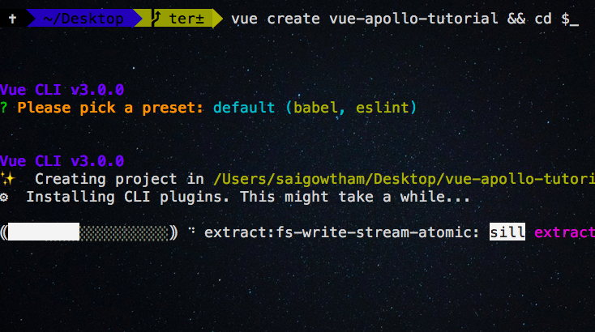
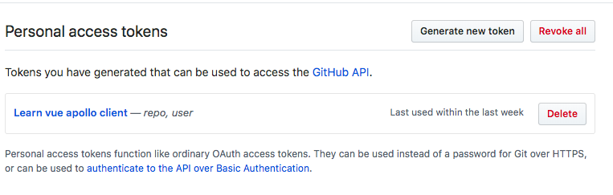
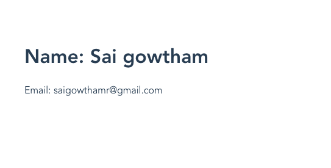
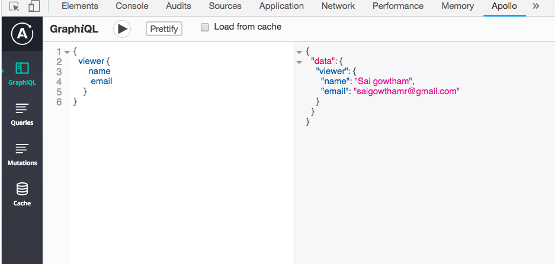
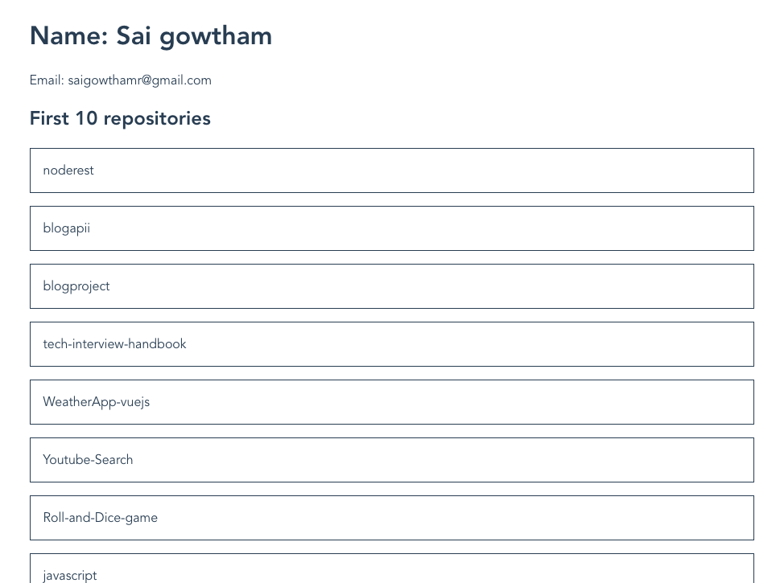
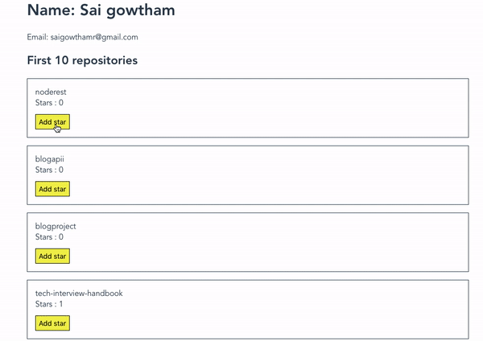

In this tutorial, we are going to learn how to fetch and update the data from the graphql APIs in vuejs using Apollo client.

>Note: We are using the GitHub graphql API for the learning purposes.

*if you stuck anywhere in this tutorial, then please refer to the final code repository on [GitHub](https://github.com/saigowthamr/vue-apollo-tutorial)*

## Creating Vue app

>This tutorial assumes that you already installed [vue cli](/vue-cli3-tutorial-creating-project/) in your pc.

Let's create a new vue app by running the following command in your terminal.

```bash
vue create vue-apollo-tutorial && cd $_
```

This above command will download the vue app related files inside your `vue-apollo-tutorial` folder and it changes your current working directory to `vue-apollo-tutorial`.



Now we need to install Apollo client packages from the `npm`.

## Installing apollo client packages

```bash
npm i vue-apollo apollo-boost graphql
```
This above command will download the three packages which are `vue-apollo`,`apollo-boost`, and `graphql`.

## Connecting with GitHub GraphQL API

Let's connect our vue app with the GitHub Graphql API.

Open your GitHub account and navigate to settings then click on developer settings and generate personal access token by selecting the fields.



>Note: copy the personal access token and save it in your pc because the token is only visible once.


Now open your `main.js` file and add the following code with your personal access token example `Bearer 2834903039-3-389-032`.

```js{9-19}:title=main.js
import Vue from 'vue'
import VueApollo from 'vue-apollo';
import ApolloClient from 'apollo-boost'
import App from './App.vue'

Vue.use(VueApollo);

//creating apollo client
const client = new ApolloClient({
  uri: "https://api.github.com/graphql",
  request: operation => {
    operation.setContext({
      headers: {
        authorization: 'Bearer '+'your-personal-access-token'
      },
    });
  }
});


const apolloProvider = new VueApollo({
  defaultClient: client,
})

//injecting apolloProvider to root vue instance
new Vue({
  render: h => h(App),
  apolloProvider,
}).$mount('#app')
```
Here we import an *ApolloClient* constructor from the `apollo-boost` package and instantiate the client by passsing the `uri`.

**uri**: The graphql endpoint we are using to fetch the data.

**request**: For every request, we are sending the authorization header to verify the present user.

Now we can send queries and mutations to our graphql endpoint from any  vue component.


## Queries

>In GraphQL __Query__ means to get the data from the API.

Let's write our first query which helps us to get our GitHub `name` and `email`.

```html{3,4,12,16,19-24}:title=App.vue
<template>
  <div id="app">
    <div v-if="$apollo.loading">Loading..</div>
    <div v-else>
      <h1>Name: {{viewer.name}}</h1>
      <p>Email: {{viewer.email }}</p>
    </div>
  </div>
</template>

<script>
import { gql } from "apollo-boost";
export default {
  data: function() {
    return {
        //query data is added
      viewer: {}
    };
  },
  apollo: {
      //this query will update the `viewer` data property
    viewer: {
      query: gql`
        {
          viewer {
            name
            email
          }
        }`
    }
  }
};
</script>
```
In the above code we have added a `query` inside apollo object where `viewer` property is same in `apollo` object and `data` object so that when our query is resolved `viewer` data property is
updated with the result we got from the api.


Now we can see name and email is rendered on the `screen`.




## Apollo client devtools

Let’s install the Apollo client dev tools from the [chrome web store](https://chrome.google.com/webstore/detail/apollo-client-developer-t/jdkknkkbebbapilgoeccciglkfbmbnfm).

Once you successfully installed we can access the GraphiQL playground from the dev tools tab. By using GraphiQL playground we can send queries and mutations to the server.

Now open your chrome dev tools and click on apollo tab you will see a GraphiQL playground.



The left side data on the image is the query and right side data is the result.

## Passing arguments to queries

We can also filter queries by passing the arguments.

create a new file called `my-repos.vue` in your components folder and add the below code.

```html{2,7-9,19,23-29}:title=my-repos.vue
<template>
  <div class="repos">
    <div v-if="$apollo.loading"></div>
    <div v-else>
      <h2>First 10 repositories</h2>
      <!-- looping through viewer repos -->
      <ul v-for="repo in viewer.repositories.edges" :key="repo.node.id">
        <li>{{repo.node.name}}</li>
      </ul>
    </div>
  </div>
</template>

<script>
import { gql } from "apollo-boost";
export default {
  data: function() {
    return {
      viewer: []
    };
  },
  apollo: {
    viewer: {
      query: gql`
       {
          viewer {
            repositories(first: 10) {
              edges {
                node {
                  id
                  name
                }
              }
            }
          }
        }`
    }
  }
};
</script>
```

In the above code, we are querying for the viewer `repositories` by passing an argument `first:10` so that we can only get the first 10 repositories.



## Passing arguments using Query variables

So far we are passing the static values to the arguments let’s replace the static values with the dynamic values by using `query` variables.

```gql
query MyRepos($first: Int!) {
  viewer {
    repositories(first: $first) {
      edges {
        node {
          id
          name
        }
      }
    }
  }
}
```
The query variable names are always preceding by a `$` character.

The static value is replaced by a `$first` variable name so that we can pass the value to query dynamically by using a `$first` variable.

Let's see how we can pass the `variables` inside our `my-repos` component.

```html{25,27,39}:title=my-repos.vue
<template>
  <div class="repos">
    <div v-if="loading">Loading..</div>
    <div v-else>
      <h2>First 10 repositories</h2>
      <!-- looping through viewer repos -->
      <ul v-for="repo in viewer.repositories.edges" :key="repo.node.id">
        <li>{{repo.node.name}}</li>
      </ul>
    </div>
  </div>
</template>

<script>
import { gql } from "apollo-boost";
export default {
  data: function() {
    return {
      viewer: [],
      loading:true
    };
  },
  apollo: {
    viewer: {
      query: gql
      `query MyRepos($first: Int!) {
          viewer {
            repositories(first: $first) {
              edges {
                node {
                  id
                  name
                }
              }
            }
          }
        }
      `,
      variables: { first: 10 },
      result:function({data}){
        if(data){
          this.loading=false
        }
      }
    }
  }
};
</script>
```
In the above code, we have added a `variables` to `apollo` object so that `$first` in the query is repalced with `10`.


## Mutations

To modify the data in GraphQL we need to send `mutations` instead of `queries`.

Mutations purpose is to `add` or `remove` or `update` the data.


Example of adding a star to your GitHub repository.

```gql
mutation AddStar($repoid:ID!){
   addStar(input:{starrableId:$repoid}){
    starrable{
      viewerHasStarred
    }
  }
}
```
once the mutation is completed it returns the data back from the backend.

the output from the backend

```gql
{
  "data": {
    "addStar": {
      "starrable": {
        "viewerHasStarred": true
      }
    }
  }
}
```

Let’s create a new file called add-star.js.

Now we are implementing the `Addstar` component which helps us to add the star to your repositories.

Vue apollo package is also Provides the `<ApolloMutation>` component which is used to send the mutations to the graphql API.

In the `<ApolloMutation>` component, we need to pass the `mutations` and `variables` as a prop and use the [vue scoped slot feature](https://vuejs.org/v2/guide/components-slots.html#Scoped-Slots) to pass down the results.

```html{3-5,21-26}:title=add-star.vue
<template>
  <div class="addStar">
    <ApolloMutation :mutation="addStar" :variables="{repoid:id}"
     @done="onDone">
      <template slot-scope="{ mutate, loading, error }">
        <div v-if="loading">Loading</div>
        <button :disabled="loading" @click="mutate()">Add star</button>
        <p v-if="error">An error occured: {{ error }}</p>
      </template>
    </ApolloMutation>
  </div>
</template>

<script>
import { gql } from "apollo-boost";
export default {
  props: ["id", "refetch"],
  data: function() {
    return {
      addStar: gql`
        mutation AddStar($repoid: ID!) {
          addStar(input: { starrableId: $repoid }) {
            starrable {
              viewerHasStarred
            }
          }
        }
      `
    };
  },
  methods: {
    onDone: function() {
      this.refetch();
    }
  }
};
</script>
```
Here we passed a `addStar` `mutation`  and `vairables` as a prop to `<ApolloMutation>` component.In `scoped slot` we can access the `mutate` function ,`error` and `loading` variables.

Once the mutation is completed `ApolloMutation` component is invoking the `@done` event so that we are passing the `onDone` method which helps us to call the `refetch` so that we can see the updated data in the `UI`.

Update the `my-repos.vue` file by adding a `AddStar` component.

```html{10-13,21,29-31,62}:title=my-repos.vue
<template>
  <div class="repos">
    <div v-if="loading">loading</div>
    <div v-else>
      <h2>First 10 repositories</h2>
      <!-- looping through viewer repos -->
      <ul v-for="repo in viewer.repositories.edges" :key="repo.node.id">
        <li>{{repo.node.name}}</li>
        <li>Stars : {{repo.node.stargazers.totalCount}}</li>
        <!-- add star component only renders when viewer is not starred -->
        <li v-if="!repo.node.viewerHasStarred">
          <AddStar :id="repo.node.id" :refetch="refetch"/>
        </li>
      </ul>
    </div>
  </div>
</template>

<script>
import { gql } from "apollo-boost";
import AddStar from "./add-star";
export default {
  data: function() {
    return {
      viewer: [],
      loading: true
    };
  },
  components: {
    AddStar
  },
  apollo: {
    viewer: {
      query: gql`
        query MyRepos($first: Int!) {
          viewer {
            repositories(first: $first) {
              edges {
                node {
                  id
                  name
                  viewerHasStarred
                  stargazers {
                    totalCount
                  }
                }
              }
            }
          }
        }
      `,
      result: function({ data }) {
        if (data) {
          this.loading = false;
        }
      },
      variables: { first: 10 }
    }
  },
  methods: {
    refetch: function() {
      this.$apollo.queries.viewer.refetch();
    }
  }
};
</script>
```

Here we added an `AddStar` component with a conditional statement so that it will only render when a viewer is not starred at.

Let's test our app now by clicking on `Add star` button.




**[Code repository](https://github.com/saigowthamr/vue-apollo-tutorial)**