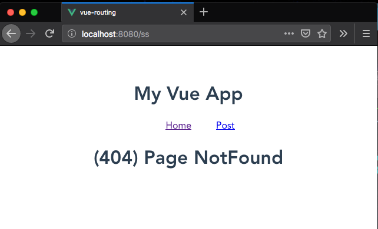

In this tutorial, we are going to learn about handling 404 errors in vue router.


## What is a 404 page?

A 404 page is also called not found page it means when a user navigates to the wrong path that doesn’t present in our website, we need to show them a `not found page` instead of blank page.


## Creating 404 page

In your components folder create a new file called `404.vue` and add the below code.

```html{3}:title=404.vue
<template>
  <div class="hello">
    <h1>(404) Page NotFound</h1>
  </div>
</template>

<script>
export default {};
</script>
```

Now, in our routes array, we need to use the wild card (`*`) character as a `path` to handle the 404 errors.

```js{15}
import Vue from 'vue'
import App from './App.vue';
import VueRouter from "vue-router";
import Home from './components/Home.vue';
import Post from './components/Post.vue';
import NotFound from './components/404.vue';

Vue.use(VueRouter);

const router = new VueRouter({
  mode: "history",
  routes: [
    { path: '/', component: Home },
    { path: '/post', component: Post },
    { path: '*', component: NotFound }
  ]
})

Vue.config.productionTip = false

new Vue({
  router,
  render: h => h(App),
}).$mount('#app')
```

 Here we added a `path:'*'`, so that if any user navigates to the wrong path they are seeing a `Not found` page.

