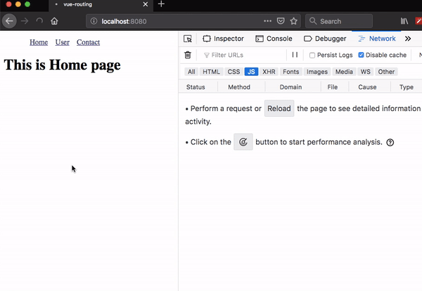

Lazy loading helps us to split our code into chunks and load that chunk when a route is activated.

## Getting started

First, we are creating a new vue project by using `vue-cli`.

```bash
vue create vue-lazy
```
This above command will download vue-related files into `vue-lazy` folder.

Change your working directory by running the following command.

```bash
cd vue-lazy
```

Now, open `vue-lazy` folder in your favorite code editor.

## Creating components

Let's create three new components inside our `components` folder so that we can create routing.

```html:title=Home.vue
<template>
  <div>
    <h1>This is Home page</h1>
  </div>
</template>
```
```html:title=User.vue
<template>
  <div>
    <h1>This is User page</h1>
  </div>
</template>
```

```html:title=Contact.vue
<template>
  <div>
    <h1>This is Contact page</h1>
  </div>
</template>
```


## Installing vue router

Let's install the `vue router` package from the npm.

```bash
npm i vue-router
```

## Creating Lazy routes

For lazy loading, we need to use the **dynamic import syntax** instead of normal imports.

Open your `main.js` replace it with below code.

```js{7-8}:title=main.js
import Vue from 'vue'
import App from './App.vue';
import VueRouter from "vue-router";
import Home from './components/Home.vue';

 // dynamic imports
const User = () => import('./components/User.vue');
const Contact = () => import('./components/Contact.vue');

Vue.use(VueRouter);

const router = new VueRouter({
  mode: "history",
  routes: [
    { path: '/', component: Home },
    {path: '/user', component: User},
    {path: '/contact', component: Contact}
  ]
})

Vue.config.productionTip = false

new Vue({
  router,
  render: h => h(App),
}).$mount('#app')
```

## Adding Navigation

```html:title=App.vue
<template>
  <div id="app">
    <ul class="nav">
      <router-link to="/">Home</router-link>
      <router-link to="/user">User</router-link>
      <router-link to="/contact">Contact</router-link>
    </ul>
    <router-view></router-view>
  </div>
</template>

<script></script>

<style>
a {
  margin-left: 1rem;
}
</style>
```

Let's test our vue app in the browser by opening network panel.


