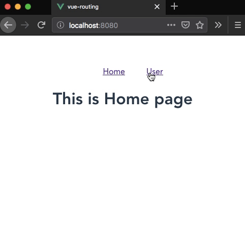

In this tutorial, we will learn about nested routing in vue router with the help of an example.


## Nested Routing

Nested routing helps us to render sub-routes inside a particular route like `user/1` or `user/1/post`.

In vue router normally we define one root `<router-view>` outlet where it renders the component which matches the defined `path` similarly, a rendered component can also contain it's own, nested `<router-view>`.

Let's create a `User` component with `<router-view>` outlet.

```html{4}:title=User.vue
<template>
  <div>
    <h1>User page</h1>
    <router-view></router-view>
  </div>
</template>
```
To create a nested routing inside `User` component we need to add `child` routes in vue router constructor.

```js{17}:title=main.js
import Vue from 'vue'
import App from './App.vue';
import VueRouter from "vue-router";
import Home from './components/Home.vue';
import User from './components/User.vue';
import UserInfo from './components/UserInfo.vue';

Vue.use(VueRouter);

const router = new VueRouter({
  mode: "history",
  routes: [
    { path: '/', component: Home },
    {
      path: '/user', component: User, children: [
          //UserInfo component is rendered when /user/:id is matched
        { path: ':id', component: UserInfo, props: true }
      ]
    },
  ]
})

new Vue({
  router,
  render: h => h(App),
}).$mount('#app')
```
In the above code, we have added `children` array with nested routes in our `User` component.so that `UserInfo` component is rendered inside the `User` component when it matches `user/:id`.

Now inside `UserInfo` component we can access the dynamic segment `id` with props.

```html{9}:title=UserInfo.vue
<template>
  <div>
    <h2>User ID {{id}}</h2>
  </div>
</template>

<script>
export default {
  props: ["id"]
};
</script>
```

Let's update our `User` component by adding navigation for the nested routes.

```html{6-8}:title=User.vue
<template>
  <div>
    <h1>User page</h1>
    <strong>Select a user</strong>
    <ul class="nav">
      <router-link to="/user/1">User 1</router-link>
      <router-link to="/user/2">User 2</router-link>
      <router-link to="/user/3">User 3</router-link>
    </ul>
    <router-view></router-view>
  </div>
</template>

<script>
</script>
```

