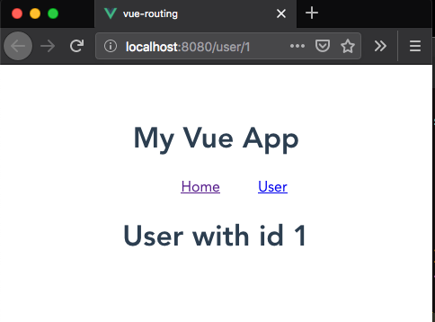
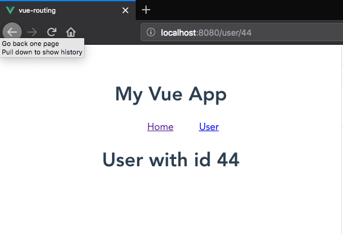

In this tutorial, we are going to learn about how to implement dynamic routing in vue router.


In vue router, we are rendering the components based on the path matching but sometimes if we have
10 users where we need to show the data of each `user` based on their `id` in such cases we need to use the dynamic segment in the path.

>Dynamic segment is added by using colon `:nameofthesegment`

```js{13-14}:title=main.js
import Vue from 'vue'
import App from './App.vue';
import VueRouter from "vue-router";
import Home from './components/Home.vue';
import User from './components/User.vue';

Vue.use(VueRouter);

const router = new VueRouter({
  mode: "history",
  routes: [
    { path: '/', component: Home },
     // dynamic segement `:id` is added to the path
    { path: '/user/:id', component: User },
  ]
})

Vue.config.productionTip = false

new Vue({
  router,
  render: h => h(App),
}).$mount('#app')
```

Now inside our `User` component, we can access the dynamic segment with `this.$route.params`.

```html{3,12}:title=User.vue
<template>
  <div class="hello">
    <h1>User with id {{userId}}</h1>
  </div>
</template>

<script>
export default {
  data: function() {
    return {
        //id is name of the dynamic segment we created in router
      userId: this.$route.params.id
    };
  }
};
</script>
```

Now we can use the dynamic paths `user/1` or `user/2`.




## Accessing Dynamic segement with props

We can also access the dynamic segment inside our component by using props.

To use `props` first we need to enable the `props` in our dynamic path.

```js{13-14}:title=main.js
import Vue from 'vue'
import App from './App.vue';
import VueRouter from "vue-router";
import Home from './components/Home.vue';
import User from './components/User.vue';

Vue.use(VueRouter);

const router = new VueRouter({
  mode: "history",
  routes: [
    { path: '/', component: Home },
    //props are enabled
    { path: '/user/:id', component: User, props: true },
  ]
})

Vue.config.productionTip = false

new Vue({
  router,
  render: h => h(App),
}).$mount('#app')
```

Now,in our `User` component we need to declare an `id` prop.

```html{3,9}:title=User.vue
<template>
  <div class="hello">
    <h1>User with id {{id}}</h1>
  </div>
</template>

<script>
export default {
  props: ["id"]
};
</script>
```

