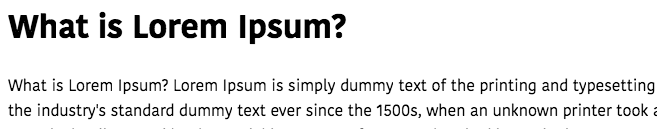

In this tutorial, we will learn about how to use slots in vue.js with the help of examples.


## What is Slot ?

Slot helps us to pass the data between the opening and closing component tags.

>In Vue.js props are used to pass the data to its child components but its is hard to pass the complex code.In such cases __slots__ can be used.

Let's create a new component called Post by adding `<slot>` element.

```html{3}:title=Post.vue
<template>
 <div>
   <slot></slot>
 </div>
</template>

<script>
export default{

}
</script>
```

Now if we pass any content between  `Post` component opening and closing tags is rendered in the place of `<slot></slot>` element.

```html{3}:title=App.vue
<template>
  <div>
    <Post>
      <h1>What is Lorem Ipsum?</h1>
      <p>
        What is Lorem Ipsum?Lorem Ipsum is simply dummy text of the printing
        andtypesetting industry.Lorem Ipsum has been the industry's standard
        dummy.
      </p>
    </Post>
  </div>
</template>

<script>
import Post from "./components/Post";
export default {
  components: {
    Post
  }
};
</script>
```


## Named Slots

Sometimes we need to pass the content to particular places in such cases we need to use named slots.


The named slots can be created by adding name attribute to the `<slot>` element.

```html{3-4}:title=Post.vue
<template>
 <div>
   <slot name="title"></slot>
   <slot name="description"></slot>
 </div>
</template>

<script>
export default{

}
</script>
```
To pass the content to the named slots we need to add a `slot` attribute with name to our html elements.

```html{4-5}:title=App.vue
<template>
  <div>
    <Post>
      <h1 slot="title">What is Lorem Ipsum?</h1>
      <p slot="description">
        What is Lorem Ipsum?Lorem Ipsum is simply dummy text of the printing
        andtypesetting industry.Lorem Ipsum has been the industry's standard
        dummy.
      </p>
    </Post>
  </div>
</template>

<script>
import Post from "./components/Post";
export default {
  components: {
    Post
  }
};
</script>
```