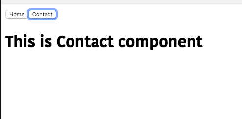
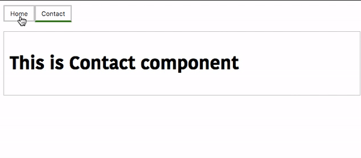

In this tutorial, we are going to learn about how to dynamically switch from one
component to another component by creating a tabbed interface with Vue.js.


## Getting started

Let's create a new vue project by using [vue-cli](/vue-cli3-tutorial-creating-project/).

Open your terminal and run the following command to create a vue project.

```bash
vue create vue-tabs
```
This above command will download the vue-related files inside the `vue-tabs` folder.

Now change your current  working directory by running the below command.

```bash
cd vue-tabs
```
Now open your `vue-tabs` project folder in your favorite code editor.

## Creating components

Let's create two new components called `Home` and `Contact` inside our `components` folder.

*Home component*
```html:title=Home.vue
<template>
  <div>
   <h1>This is Home component</h1>
  </div>
</template>

<script>
export default {};
</script>
```
*Contact component*

```html:title=Contact.vue
<template>
  <div>
   <h1>This is Contact component</h1>
  </div>
</template>

<script>
export default {};
</script>
```

## Creating tabs

Let's create a tabbed interface by importing our two components inside `App.vue` file.

Vue.js provides us a `<component>` element which is used to render the components dynamically by adding `:is` special attribute.

```html{7,18-19}:title=App.vue
<template>
  <div>
    <button v-for="tab in tabs" :key="tab" @click="selected = tab;">
      {{ tab }}
    </button>

    <component :is="selected"></component>
  </div>
</template>

<script>
import Home from "./components/Home";
import Contact from "./components/Contact";

export default {
  data: function() {
    return {
      tabs: ["Home", "Contact"],
      selected: "Home"
    };
  },
  components: {
    Home,
    Contact
  }
};
</script>
```

Inside our template we have added a `<component>` element with `:is="selected"`
 attribute,by default `selected` property is pointing to  `Home` component.

We are updating our `selected` property based on the name of a component.


Let's test our app.



## Adding styles

Let's add the active styles to our `tab` button so that we can know currently which tab is displaying.

Update your `App.vue` file by adding below styles.

```html{4,7}:title=App.vue
<template>
  <div>
    <button
      v-for="tab in tabs"
      :key="tab"
      @click="selected = tab;"
      :class="['tab-btn', { active: selected === tab }]"
    >
      {{ tab }}
    </button>

    <component :is="selected" class="tab"></component>
  </div>
</template>

<script>
import Home from "./components/Home";
import Contact from "./components/Contact";

export default {
  data: function() {
    return {
      tabs: ["Home", "Contact"],
      selected: "Home"
    };
  },
  components: {
    Home,
    Contact
  }
};
</script>

<style>
.tab-btn {
  padding: 6px 10px;
  background: #ffffff;
  cursor: pointer;
  margin-bottom: 1rem;
  border: 2px solid #cccccc;
  outline: none;
}

.active {
  border-bottom: 3px solid green;
  background: #fcfcf;
}

.tab {
  border: 1px solid #ccc;
  padding: 10px;
}
</style>
```

output:

