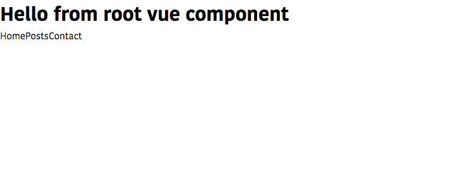
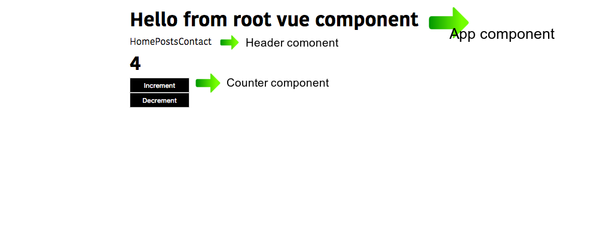
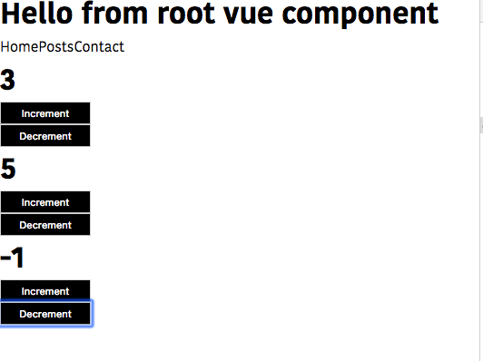

In this tutorial, we will learn about how to create components in Vue.js.


## What is Component?

A component is a reusable piece of code it means we create once and reuse it throughout in our vue app.

for example Buttons, Footer, Header.


## Getting started

First, we are bootstrapping our vue.js app by using the [vue command line tool](/vue-cli3-tutorial-creating-project/).


Open your terminal and run following command.

```bash
vue create vue-app
```
This above command will download the required files in the vue-app folder.


Change your working directory by using `cd vue-app` then open your project folder by using your favorite code editor.

Inside your `src` folder navigate to `App.vue` file which is a root vue component.

Now remove everything present in our `App.vue` file and let's write it from scratch.


In every Vue component we need to declare three important tags which are  `<template>`, `<script>` and `<style>`.

`template tag`: it contains HTML markup for our component.

`script tag`: it contains JavaScript related code.

`style tag`: it contains CSS related code

```html:title=App.vue
<template>
 <div>
   <h1>Hello from root vue component</h1>
 </div>
</template>

<script>
  export default {

  }
</script>

<style>
  *{
      box-sizing:border-box;
      margin:0;
  }
</style>
```


Inside our script tag, we are exporting the default object if you open your `main.js` file, our `App.vue` file is imported and connected to the `Vue` instance, so that our `App.vue` file is a starting point of our app.

The object we exporting inside the `script` tag can accept various options such as data, computed, watch, methods, and lifecycle hooks.

Let's create a new component called `Header` in our `components` folder.


```html:title=Header.vue
<template>
  <nav>
    <a>Home</a>
    <a>Posts</a>
    <a>Contact</a>
  </nav>
</template>

<script>
   export default{

   }
</script>

<style>

</style>
```

our Header component is currently not rendered in our dom because in vue we need to register our components so that it knows we have created a new component.

Let's register our `Header` component inside our `App.vue` file because it's a root Vue component.

```html{8,10-12}:title=App.vue
<template>
 <div>
   <h1>Hello from root vue component</h1>
 </div>
</template>

<script>
import Header from './components/Header'
  export default {
     components:{
         'my-header':Header
     }
  }
</script>

<style>
  *{
      box-sizing:border-box;
      margin:0;
  }
</style>
```

Here we registered our `Header` component as `my-header`.

Now, we can use `my-header` as a custom HTML tag inside our `template` tag present in `App.vue` file.

```html{4,9,11-13}:title=App.vue
<template>
 <div>
   <h1>Hello from root vue component</h1>
   <my-header></my-header>
 </div>
</template>

<script>
import Header from './components/Header'
  export default {
     components:{
         'my-header':Header
     }
  }
</script>

<style>
  *{
      box-sizing:border-box;
      margin:0;
  }
</style>
```
output




Have you seen our `Header` component is rendered on the screen?


Let's create one more component called `Counter` inside the components
folder.

create a new file called `Counter.vue`

```html:title=Counter.vue
<template>
  <div class="counter">
    <h1>{{ count }}</h1>
    <button @click="count = count + 1;">Increment</button>
    <button @click="count = count - 1;">Decrement</button>
  </div>
</template>

<script>
export default {
  data: function() {
    return {
      count: 0
    };
  }
};
</script>

<style scoped>
.counter {
  display: flex;
  flex-direction: column;
  width: 100px;
}

button {
  background-color: black;
  color: white;
  padding: 5px;
}
</style>
```

Here added one data property to our `Counter` component.

>Note: Inside Vue components, the data property should be a function which is returning the object. The properties inside that object can only available within that component.

In style tag we have added a property called `scoped`, it means the styles we declared here can only available inside the `Counter.vue` file.


Now we need to register our `Counter` component inside the `App.vue` file by importing the `Counter.vue` file.

```html{5,11,14-15}:title=App.vue
<template>
 <div>
   <h1>Hello from root vue component</h1>
   <my-header></my-header>
   <my-counter></my-counter>
 </div>
</template>

<script>
import Header from './components/Header';
import Counter from './components/Counter';
  export default {
     components:{
         'my-header':Header,
         'my-counter':Counter
     }
  }
</script>

<style>
  *{
      box-sizing:border-box;
      margin:0;
  }
</style>
```
Here we registered our `Counter` component as `my-counter`.

rendered output:




## Reusing the Components

Let's reuse our `counter` component inside the `App.vue` file.


```html{5-7}:title=App.vue
<template>
 <div>
   <h1>Hello from root vue component</h1>
   <my-header></my-header>
   <my-counter></my-counter>
   <my-counter></my-counter>
   <my-counter></my-counter>
 </div>
</template>

<script>
import Header from './components/Header';
import Counter from './components/Counter';
  export default {
     components:{
         'my-header':Header,
         'my-counter':Counter
     }
  }
</script>

<style>
  *{
      box-sizing:border-box;
      margin:0;
  }
</style>
```

Here we reused `my-counter` three times inside our `template` so that we can see three counters rendered on the screen.

