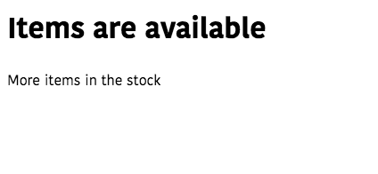

In this tutorial, we are going to learn about conditional rendering in
Vue.js.

## What is Conditional rendering?

Conditional rendering means to add or remove elements from the dom if a particular condition is true.


In Vue, we need to use `v-if` directive to render the elements conditionally.

Let's see an example.

```html{3}
<template>
  <div>
  <!-- v-if="javascript expression" -->
   <h1 v-if="isActive">Hello Vuejs</h1>
   <button @click="isActive= !isActive">Click</button>
  </div>
</template>

<script>

export default{
    data:function(){
        return{
            isActive:false
        }
    }
}
</script>
```
In the above code we have added a `v-if` directive with property `isActive` so that `h1` element only render into the dom, if `isActive` property is `true`.


We can also extend the `v-if` directive followed by the `v-else` directive.

```html{2}
   <h1 v-if="isActive">Hello Vuejs</h1>
   <h1 v-else>Hey Vuejs</h1>
```

If `isActive` property is true first `h1` element will render otherwise second `h1` element will render into the dom.

We can also further extend it using `v-else-if` block.

```html
   <h1 v-if="isActive">Hello Vuejs</h1>
   <h1 v-else-if="isActive && a.length===0">You're vuejs</h1>
   <h1 v-else>Hey Vuejs</h1>
```
`v-else-if` directive works like a  else-if block in JavaScript.

>Note: A v-else element must immediately follow a  v-if element or v-if-else element - otherwise it will not be recognized.


## How to render multiple elements conditionally?

Sometimes we have to render multiple elements conditionally in such cases we
need to group the elements together.

```html{2,6}
<template>
  <div v-if="available">
    <h1>Items are available</h1>
    <p>More items in the stock</p>
  </div>
  <div v-else>
    <h1>Items are not available</h1>
    <p>Out of stock</p>
  </div>
</template>

<script>
export default {
  data: function() {
    return {
      available: true
    };
  }
};
</script>

```

Here we group the multiple elements in a `div` tag.

