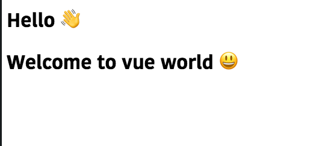
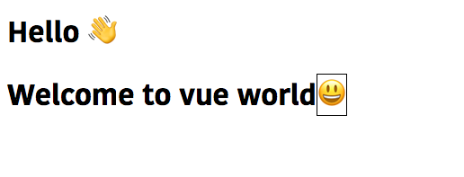

In this tutorial, we are going to learn about how to create custom directives in vuejs.


## What is a Directive?

Directives are custom HTML attributes prefixed with `v-` which tells library to do something with
the dom elements.

Example: `v-model`,`v-if`,`v-for` (These are some built in directives).


## Creating Custom Directive

Let's create our own custom directive called `v-emoji` which helps us to add the emojis to
our content.

Global Directives can be added before the `Vue` instance in `main.js` file.

```js{6-10}:title=main.js
import Vue from "vue";
import App from "./App.vue";

Vue.config.productionTip = false;

Vue.directive("emoji", {
  inserted: function(el) {
    el.textContent +=  '👋';
  }
});

new Vue({
  render: h => h(App)
}).$mount("#app");
```
In the above code we have created a directive called `emoji` where `inserted` is a lifecycle hook of the directive.

**inserted**: called when a bound element has been inserted into its parent node (this only guarantees parent node presence, not necessarily in-document).

Each hook can accept four parameters `el`,`binding`,`vnode`,`oldvnode`.

## Using our custom Directive

Let's use our custom directive inside the `template`.

```html{3}:title=App.vue
<template>
  <div id="app">
    <h1 v-emoji>Hello</h1>
  </div>
</template>

<script>

</script>
```
The `v-emoji` directive adds the `waving hand` emoji to our `h1` element.

output:


But currently `v-emoji` can only add `waving handing` emoji to our HTML elements.

## Passing the values to directives

Let's modify our `emoji` directive so that we can pass our own `emojis` to the directive instead of using the same emoji.

```js{8}:title=main.js
import Vue from "vue";
import App from "./App.vue";

Vue.config.productionTip = false;

Vue.directive("emoji", {
  inserted: function(el, binding) {
    el.textContent += " " + binding.value;
  }
});

new Vue({
  render: h => h(App)
}).$mount("#app");
```

Now we can pass our `emojis` to `v-emoji` directive.

```html{3-4,12-13}:title=App.vue
<template>
  <div id="app">
    <h1 v-emoji="hand">Hello</h1>
    <h1 v-emoji="smiling">Welcome to vue world</h1>
  </div>
</template>

<script>
export default {
  data: function() {
    return {
      smiling: "😃",
      hand: "👋"
    };
  }
};
</script>
```

output:



## Adding modifiers to our custom Directives

Let's add the `border` modifier to our custom directive `v-emoji` so that it adds `border` to our `emoji`.

```html{8-11}:title=main.js
import Vue from "vue";
import App from "./App.vue";

Vue.config.productionTip = false;

Vue.directive("emoji", {
  inserted: function(el, binding) {
    if (binding.modifiers.border) {
      el.innerHTML += `<span style="border:1px solid #000">${
        binding.value
      }</span>`;
    } else {
      el.textContent += " " + binding.value;
    }
  }
});

new Vue({
  render: h => h(App)
}).$mount("#app");
```

Using `border` modifier.

```html{4}:title=App.vue
<template>
  <div id="app">
    <h1 v-emoji="hand">Hello</h1>
    <h1 v-emoji.border="smiling">Welcome to vue world</h1>
  </div>
</template>

<script>
export default {
  data: function() {
    return {
      smiling: "😃",
      hand: "👋"
    };
  }
};
</script>
```

output:

