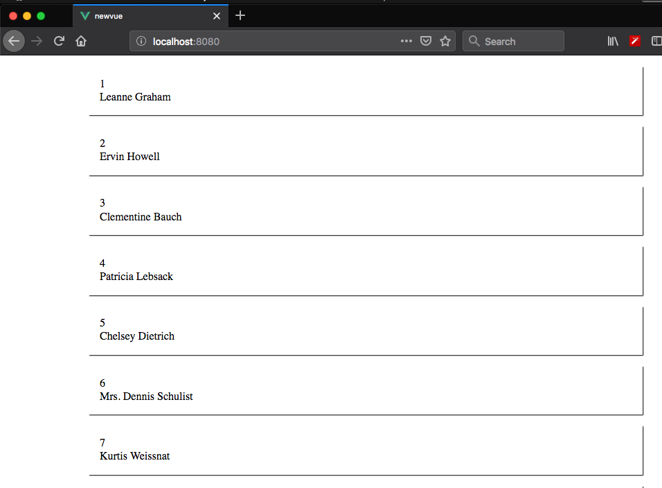

In this tutorial, we are going to learn about creating a global property in vuejs with the help of an example.


Sometimes we need to access a particular data throughout our app components in such cases we can create a global property in vuejs by using `Vue.prototype.$propertyname`.


## Creating a global property

In this example, we are creating a `$axios` global property so that we can directly use `axios` in our components to make http requests.

Open you `main.js` file and the below code.

```js{5}:title=main.js
import Vue from 'vue'
import App from './App.vue'
import axios from 'axios'

Vue.prototype.$axios = axios


new Vue({
  render: h => h(App),
}).$mount('#app')
```

## Accessing global property


Now we can access `$axios` global property from any component instance.

```html{18}:title=App.vue
<template>
  <div id="app">
    <ul v-for="user in users" :key="user.id">
      <li>{{user.id}}</li>
      <li>{{user.name}}</li>
    </ul>
  </div>
</template>

<script>
export default {
  data: function() {
    return {
      users: []
    };
  },
  created: function() {
    this.$axios.get("https://jsonplaceholder.typicode.com/users")
    .then(res => {
      this.users = res.data;
    });
  }
};
</script>
```
output:

