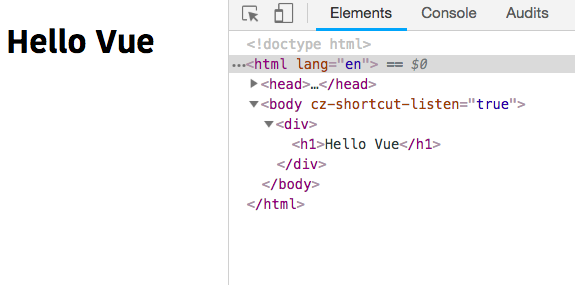

In this tutorial, we are going to learn about different types of VueJS directives with the help of examples.

## Contents

- [v-html](#v-html)
- [v-text](#v-text)
- [v-bind](#v-bind)
- [v-on](#v-on)
- [v-model](#v-model)
- [v-if](#v-if)
- [v-for](#v-for)


## What is a Directive ?

A Directive is a special HTML attribute which starts with `v-`, where it helps to bind javascript expressions.


## v-html

The `v-html` attribute helps us to interpolate the real html instead of plain text.

example:

```html{2,9}
<template>
  <div v-html="myHTML"></div>
</template>

<script>
export default{
    data:function(){
      return{
        myHTML: "<h1>Hello Vue</h1>"
    }
  }
}
</script>
```


## v-text

The `v-text` attribute is used to add the text to an html element.

example:

```html{2,9}
<template>
  <h1 v-text="title"></h1>
</template>

<script>
export default {
  data: function() {
    return {
      title:"Learn vuejs"
    };
  }
};
</script>
```


## v-bind

The `v-bind` directive dynamically binds attribute to a javascript expression.


>Binding means substitution of a real value after it has been compiled.


example:

```html{4,15}
<template>
  <div>
    <!-- binds src attribute to an expression -->
    

    <!-- v-bind shorthand syntax -->
    
  </div>
</template>

<script>
export default {
  data: function() {
    return {
      dogImage: "https://i.imgur.com/A8eQsll.jpg"
    };
  }
};
</script>
```

You can also bind other html attributes using `v-bind` directive.

```html

<a :href="homeUrl">Home</a>

<button :disabled="isActive">Click</button>

<!-- class Binding -->
<div :class="{ red: isRed }"></div>
```

## v-on

The `v-on` directive is used to attach an event listener to an html element.

example:

```html{5}
<template>
  <div>
    <h1>{{ title }}</h1>
  <!-- <button v-on:eventname="eventhandlerName">title</button> -->
    <button v-on:click="handleClick">Change title</button>
  </div>
</template>

<script>
export default {
  data: function() {
    return {
      title: "Hello"
    };
  },
  methods: {
    handleClick: function() {
      this.title = "Hello Vue";
    }
  }
};
</script>
```

We can also pass __inline expressions__ to `v-on` directive instead of a method.

```html{4}
 <template>
  <div>
    <h1>{{ title }}</h1>
     <button v-on:click="title='Hello vue'">Change title</button>
  </div>
</template>

<script>
export default {
  data: function() {
    return {
      title: "Hello"
    };
  }
};
</script>
```

## v-model

The `v-model` directive creates two data binding on a form  elements.

example:

```html{3}
<template>
  <div>
    <input v-model="name" placeholder="Name" />
    <p>{{ name }}</p>
  </div>
</template>

<script>
export default {
  data: function() {
    return {
      name: "King"
    };
  }
};
</script>
```

**select element**

```html{3}
<template>
  <form>
    <select v-model="rating">
     <option disabled value="">Choose your Rating</option>
      <option>1</option>
      <option>2</option>
      <option>3</option>
      <option>4</option>
      <option>5</option>
    </select>
    <p>You've rated: {{ rating }}</p>
  </form>
</template>

<script>
export default {
  data: function() {
    return {
      rating: ""
    };
  }
};
</script>
```

## v-if

The `v-if` directive allows us to render html elements conditionally based on the truthiness of the expression value.

example:

```html{3,12}
<template>
  <div>
    <h1 v-if="isActive">Conditional rendering</h1>
    <button v-on:click="isActive = !isActive;">Show</button>
  </div>
</template>

<script>
export default {
  data: function() {
    return {
      isActive: false
    };
  }
};
</script>
```
In the above code, we have added `v-if="isActive"` to `h1` element so that `h1` element only render into the dom when `isActive` is true.

## v-for

`v-for` directive is used to loop over the array of elements and render it into the dom.

example:

```html{4}
<template>
 <ul>
   <!-- list rendering starts -->
  <li v-for="user in users">{{user.name}}</li>
 </ul>
</template>

<script>
 export default{
     data:function(){
         return{
             users:[
                 {id:1,name:"king"},
                 {id:2,name:"gowtham"},
                 {id:3,name:"ooops"},
             ]
         }
     }
 }
</script>
```
In the above code, we are looping through the `users` array by using `v-for `directive, so that on each iteration `user` variable is pointing to the different object present inside the array.