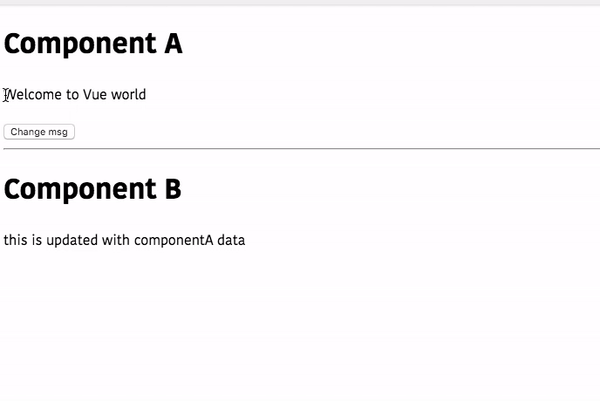

In this tutorial, we are going to learn about how to create EventBus in Vue with the help of example.


## What is EventBus?

In Vue, eventbus helps us to communicate between child components with the help of events.


>This tutorial assumes that you already installed the vue app by using [vue-cli](/vue-cli3-tutorial-creating-project/).


Let's create a new file called `eventbus.js` inside your `src` folder and add the below code.

```js:title=eventbus.js
import Vue from 'vue';
export const eventBus = new Vue();
```
Here we created the eventbus by exporting the new vue instance.

It's time to use our event bus.

create a new component called `componentA.vue` inside your components folder.

```html:title=ComponentA.vue
<template>
  <div>
    <h1>{{msg}}</h1>
    <button @click="changeMsg">change msg</button>
  </div>
</template>

<script>
import {eventBus} from '../eventbus'
 export default {
     data:function(){
         return {
             msg: "Welcome to Vue world"
         }
     },
     methods:{
         changeMsg:function(){
             this.msg = "Vue apps"
             //emitting the custom event with value
             eventBus.$emit('get-msg',this.msg)
         }
     }
 }
</script>
```
In the above code, we are emitting the custom event called `get-msg` with value.


## Listening for the events

To listen to this custom event in our second component called `ComponentB.vue` we need to use Vue `$on` method.

The `$on` method accepts two arguments, the name of the event and a callback function.

```html{17}:title=ComponentB.vue
<template>
  <div>
    <h1>{{my-msg}}</h1>
  </div>
</template>

<script>
import {eventBus} from '../eventbus'
 export default {
     data:function(){
         return {
            mymsg: "this is updated with componentA data"
         }
     },
     mounted:function(){
         //listening for the custom event
         eventBus.$on('get-msg',(msg)=>{
             this.mymsg=msg
         })
     }
 }
</script>
```

Here we are listening for the `get-msg` event so that whenever the event is emitted by the `componentA` it invokes the callback function passed to the `$on` method.

The callback function will also receive the payload as its first parameter, which is emitted by the custom event `get-msg`.


Now in your `App.vue` file import these two components.

```html:title=App.vue
<template>
  <div>
    <h1>Component A</h1>
    <ComponentA />
    <hr />
    <h1>Component B</h1>
    <ComponentB />
  </div>
</template>

<script>
import ComponentA from "./components/ComponentA";
import ComponentB from "./components/ComponentB";

export default {
  components: {
    ComponentA,
    ComponentB
  }
};
</script>
```

Let's test our vue app.

