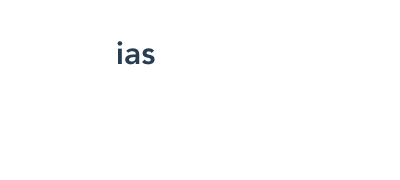
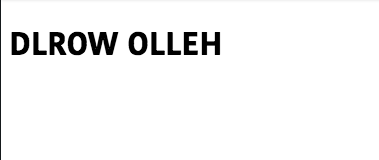

In this tutorial, we are going to learn about how to create filters in vue.js apps with the help of examples.


## Filters

In VueJS filters helps us to transform the output rendering of the data.

Filters are used in two places.
 - Musthache Interploations `{{ }}`.
 - `v-bind` expressions.

## Creating filters

In Vue, we can create two types of filters which are global and local filters.

**Global Filters** : We can access global filters throughout our Vue app.

**Local Filters** :  We can only access local filters within a component.


## Global Filters

Let's create a global filter called `reverseData`  which is used to reverse the provided string.


>Note: Global filters can be created before the vue instance.

```js:title=main.js
import Vue from "vue";
import App from "./App.vue";

Vue.filter("reverseData", function(value) {
  return value
    .split("")
    .reverse()
    .join("");
});

new Vue({
  render: h => h(App)
}).$mount("#app");

```

## Using the filter

Filters can be used with the pipe symbol `| filterName`.

```html{3}:title=App.vue
<template>
  <div id="app">
    <h1>{{ name | reverseData }}</h1>
  </div>
</template>

<script>
export default {
  data:function() {
    return {
      name: "sai"
    };
  }
};
</script>
```

Now our output rendering data is transformed from `sai` to `ias`



## Local filters

Local filters can be created inside the `filters` object of a particular component.

```html{4,14-18}:title=Dummy.vue
<template>
  <div>
    <!-- using `uppercase` filter -->
    <h1>{{ msg | uppercase }}</h1>
  </div>
</template>

<script>
export default {
  data: function() {
    return {
      msg: "hello world"
    };
  },
  filters: {
    uppercase: function(value) {
      return value.toUpperCase();
    }
  }
};
</script>
```
output:


## Chaning filters

We can also chain the filters, if we need to use the two filters for the same data.

```html{4}:title=Dummy.vue
<template>
  <div>
    <!-- using `uppercase` and reverseData filter -->
    <h1>{{ msg | uppercase | reverseData }}</h1>
  </div>
</template>

<script>
export default {
  data: function() {
    return {
      msg: "hello world"
    };
  },
  filters: {
    uppercase: function(value) {
      return value.toUpperCase();
    }
  }
};
</script>
```
In the above code, we chained two filters `msg | uppercase | reverseData`.

output:

