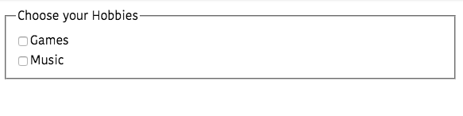

In this tutorial, we are going to learn about how to handle forms in vuejs with the help of examples.


## V-Model

In Vue `v-model` directive helps us to create two-way data binding on form `input`,`select` and `textarea` elements.


## What is two-way data binding?

Two data binding means

- The data we changed in the view has updated the state.

- The data in the state has updated the view.


## Input element example

Let's bind the `html` input element to a data property using `v-model` directive.

```html{4,14}
<template>
    <div>
      <form>
       <input type="name" placeholder="Name"  v-model="name" />
     </form>
     <p>My name is: {{name}}</p>
    </div>
</template>

<script>
  export default{
      data:function(){
        return{
          name:''
        }
      }
  }
</script>
```

In the above code, we have connected the `name` data property to a form `input` element.

## Textarea element example

The `textarea` element allows us to write the multiline text.

```html{4}
<template>
    <div>
      <form>
       <textarea  placeholder="Comment" v-model="comment" ></textarea>
     </form>
      <p style="white-space:pre-line">
         My comment is: {{comment}}
      </p>
    </div>
</template>

<script>
  export default{
      data:function(){
        return{
          comment:''
        }
      }
  }
</script>
```

## Checkbox example

Here we bind the multiple checkboxes to the same array data property `hobbies`.

```html{5,9}
<template>
  <fieldset>
    <legend>Choose your Hobbies</legend>
    <div>
      <input type="checkbox" id="coding" v-model="hobbies" />
      <label for="coding">Games</label>
    </div>
    <div>
      <input type="checkbox" id="music" v-model="hobbies" />
      <label for="music">Music</label>
    </div>
  </fieldset>
</template>

<script>
export default {
  data: function() {
    return {
      hobbies: []
    };
  }
};
</script>
```


## Select element example

```html
<template>
  <form>
    <select v-model="rating">
     <option disabled value="">Choose your Rating</option>
      <option>1</option>
      <option>2</option>
      <option>3</option>
      <option>4</option>
      <option>5</option>
    </select>
    <p>You've rated: {{ rating }}</p>
  </form>
</template>

<script>
export default {
  data: function() {
    return {
      rating: ""
    };
  }
};
</script>
```

In the above code, we have bound the `rating` property to `select` element.


## Radio button example

```html{3,5}
<template>
  <form>
    <input type="radio" id="male" value="Male" v-model="gender" />
    <label for="male">Male</label>
    <input type="radio" id="female" value="Female" v-model="gender" />
    <label for="female">Female</label>
    <p>Gender: {{ gender }}</p>
  </form>
</template>

<script>
export default {
  data: function() {
    return {
      gender: ""
    };
  }
};
</script>
```

## Submitting form

Let's see how to submit the form to the backend.

```html{2}
 <template>
  <form @submit.prevent="handleSubmit">
   <input type="name" placeholder="name" v-model="name"/>
    <input type="radio" id="male" value="Male" v-model="gender" />
    <label for="male">Male</label>
    <input type="radio" id="female" value="Female" v-model="gender" />
    <label for="female">Female</label>
    <button type="submit">Submit</button>
  </form>
</template>

<script>
export default {
  data: function() {
    return {
      name:"",
      gender: ""
    };
  },
  methods:{
      handleSubmit:function(){
          console.log('Name'.this.name);
          console.log('Gender'.this.gender);
      }
  }
};
</script>
```

Here we added a `@submit` event listener to the form `element` with `.prevent` modifier, so that we stopped the browser default re-loading behavior whenever we submit a form.