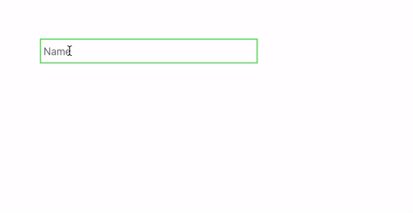
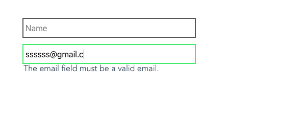

In this tutorial, we are going to learn about how to validate forms in vuejs by using veevalidate
library.


## Creating Vue App

Let's create the new Vue app by running the following command in your terminal.

```bash
vue create vue-form-validation && cd $_
```

This above command will download the Vue app related files in the `vue-form-validation` folder and change your working current directory to `vue-form-validation`.

## Installing VeeValidate

Let's install the `VeeValidate` library by running the below command in your terminal.

```bash
npm i vee-validate
```
Once you successfully installed `vee-validate` library now open your `vue-form-validation` folder in your favorite code editor and we need to tell **vuejs** to use this `vee-validate` library.

```js{5}:title=main.js
import Vue from 'vue';
import VeeValidate from 'vee-validate';
import App from './App.vue'

Vue.use(VeeValidate);

Vue.config.productionTip = false

new Vue({
  render: h => h(App),
}).$mount('#app')
```

Now we can use `vee-validate` library anywhere form our vue app.


## Validating input field

For validating input field we need to add `v-validate` attribute with value `required`

```html{6}:title=form.vue
 <template>
   <form>
   <input
        type="text"
        name="name"
        v-validate="'required'"
        placeholder="Name"
        v-model="name"
      >
    </form>
 </template>

<script>
export default {
  data: function() {
    return {
      name: ""
    };
  },
};
</script>
```

## Displaying errors

To display the errors we need to use a `errors.has()` method provided by the `vee-validate` library.

```html{10}:title=form.vue
 <template>
   <form>
   <input
        type="text"
        name="name"
        v-validate="'required'"
        placeholder="Name"
        v-model="name"
      >
      <p v-if="errors.has('name')">{{errors.first('name')}}</p>
   </form>
 </template>

<script>
export default {
  data: function() {
    return {
      name: ""
    };
  },
};
</script>
```
In the above code, we have used `errors.has('name')` to check is there any errors in input `name` field
if any error is found, we are displaying the error message with the help of `errors.first` method.

Let's test it now



## Validating Email

To validate the email field we need to add an `email` value to `v-validate` attribute.

```html{15}:title=form.vue
 <template>
   <form>
   <input
        type="text"
        name="name"
        v-validate="'required'"
        placeholder="Name"
        v-model="name"
      >
      <p v-if="errors.has('name')">{{errors.first('name')}}</p>

      <input
        type="text"
        name="email"
        v-validate="'required|email'"
        placeholder="Email"
        v-model="email"
      >
      <p v-if="errors.has('email')">{{errors.first('email')}}</p>
   </form>
 </template>

<script>
export default {
  data: function() {
    return {
      name: "",
      email:""
    };
  },
};
</script>
```



## Displaying errors based on events

We can also display the error messages based on the events like `change` or `blur` event.

```html{16}:title=form.vue
 <template>
   <form>
   <input
        type="text"
        name="name"
        v-validate="'required'"
        placeholder="Name"
        v-model="name"
      >
      <p v-if="errors.has('name')">{{errors.first('name')}}</p>

      <input
        type="text"
        name="email"
        v-validate="'required|email'"
        data-vv-validate-on="blur|change"
        placeholder="Email"
        v-model="email"
      >
      <p v-if="errors.has('email')">{{errors.first('email')}}</p>
   </form>
 </template>

<script>
export default {
  data: function() {
    return {
      name: "",
      email:""
    };
  },
};
</script>
```

Now we can only see an error message when a user stops typing and move to another field.

## Submitting Form

The VeeValidate library provides us a `validateAll` method by using this we can check if every field is valid or not at the time of form submission.

```html{19-20}:title=form.vue
 <template>
  <form>
    <input type="text" name="name"
    v-validate="'required'"
    placeholder="Name"
    v-model="name"
    >
    <p v-if="errors.has('name')">{{errors.first('name')}}</p>

    <input
      type="text"
      name="email"
      v-validate="'required|email'"
      data-vv-validate-on="blur|change"
      placeholder="Email"
      v-model="email"
    >
    <p v-if="errors.has('email')">{{errors.first('email')}}</p>
    <button class="signup-btn" :disabled="errors.items.length>0"
    @click.prevent="validateAll">Submit</button>
  </form>
</template>

<script>
export default {
  data: function() {
    return {
      name: "",
      email: ""
    };
  },
  methods: {
    validateAll() {
      this.$validator.validateAll().then(result => {
        if (result) {
          alert("Form Submitted!");
          return;
        }
      });
    }
  }
};
</script>
```