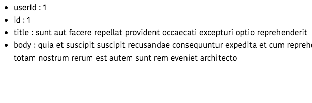

In this tutorial, we are going to learn about how to make http requests in vue apps by using axios
http library.


## What is Axios?

Axios is an http library which is used to make http requests in javascript applications.


## Fetching data using Axios

Let's fetch the data by using axios in our vue app, for learning purposes we are using the below API **endpoint**.

```bash
https://jsonplaceholder.typicode.com/posts/1
```

>This tutorial assumes that you already created a new vue project by using [Vue-cli](/vue-cli3-tutorial-creating-project/).

First, we need to install the axios library by running the following command in your terminal.

```bash
npm i axios
```

This is a simple example that fetches the data from  "json place holder API".

```html{4,22}:title=App.vue
<template>
  <div>
  <ul>
      <li v-for="(value, key) in post" :key="key">
         {{ key }} : {{ value }}
     </li>
    </ul>
  </div>
</template>

<script>
import axios from "axios";

export default {
  data() {
    return {
      post: null,
    };
  },
  created: function() {
    axios
      .get("https://jsonplaceholder.typicode.com/posts/1")
      .then(res => {
        this.post = res.data;
      })
  }
};
</script>
```
In the above code, we imported `axios` from `axios` library then we used `axios.get` method to fetch the data from the api.Once the data is available, we added it to `this.post` property.

__created__: This is a lifecycle hook called by the vuejs once the `Vue instance` is created.

Inside our template, we used `v-for` directive to loop over  the `this.post` object.


output:




## Loading Indicator

Sometimes it takes long time to get the data from the backend in such cases we need to show some loading... Indicator to the user.

To add the loading... Indicator to our example we need to define a new data property called `loading`.

```html{3,18,23,27}:title=App.vue
<template>
  <div id="app">
    <p v-if="loading">Loading...</p>
    <ul v-else>
      <li v-for="(value, key) in post" :key="key">
         {{ key }} : {{ value }}
      </li>
    </ul>
  </div>
</template>

<script>
import axios from "axios";

export default {
  data() {
    return {
      loading: false,
      post: null,
    };
  },
  created: function() {
    this.loading = true;
    axios
      .get("https://jsonplaceholder.typicode.com/posts/1")
      .then(res => {
        this.loading = false;
        this.post = res.data;
      })
  }
};
</script>
```

## Error Handling

We need to handle the errors if our `request` fails due to failed network  or something else.

To handle errors in the axios we need to use the `catch` method.

```html{9,21,32-35}:title=App.vue
<template>
  <div id="app">
    <p v-if="loading">Loading...</p>
    <ul v-else>
      <li v-for="(value, key) in post" :key="key">
        {{ key }} : {{ value }}
      </li>
    </ul>
    <p v-if="error">{{ error }}</p>
  </div>
</template>

<script>
import axios from "axios";

export default {
  data() {
    return {
      loading: false,
      post: null,
      error: ""
    };
  },
  created: function() {
    this.loading = true;
    axios
      .get("https://jsonplaceholder.typicode.com/posts/1")
      .then(res => {
        this.loading = false;
        this.post = res.data;
      })
      .catch(err => {
        this.loading = false;
        this.error = err;
      });
  }
};
</script>
```