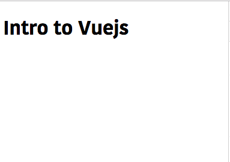
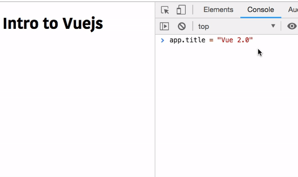

In this tutorial, we are going to learn about a basic introduction to vuejs and
its reactivity system.

## What is Vuejs?

Vuejs is a popular JavaScript framework which is used to build user interfaces. The core library is mainly focused on the view layer.

We can build modern JavaScript web apps by using Vuejs.


### Getting started

>In this tutorial we are not using Vue cli to set up our app.

Open your terminal and run following commands.

```bash
mkdir vue-intro #create a new directory in your pc

cd vue-intro #change your working directory

touch index.html #create an HTML file
```
once your successfully completed above steps now open `vue-intro` folder by using your favorite
code editor.

Add the below markup to your HTML file.

```html
<!DOCTYPE html>
<html>
<head>
    <title>Vue intro</title>
    <meta name="viewport" content="width=device-width, initial-scale=1">
</head>
<body>
<div id="app">
     <h1>Intro to Vue</h1>
</div>
</body>
</html>
```

Let's add the Vue library to our `index.html` file by using script tag.

```html
<!DOCTYPE html>
<html>
<head>
    <title>Vue intro</title>
    <meta name="viewport" content="width=device-width, initial-scale=1">
</head>

<body>
<div id="app">
    <h1>Intro to Vue</h1>
</div>
    <script src="https://cdn.jsdelivr.net/npm/vue/dist/vue.js"></script>
</body>

</html>
```

### Vue instance

Once we successfully added the script to our `HTML` file now we can access a global `Vue` function.

Vue function is used to create a new instance.

>Every vuejs app starts with by creating a Vue instance

Let's create a vue instance by passing an object to the `Vue` function.

Add the below code after the vue library script tag.

```js
var app = new Vue({
    el:"#app"
})
```

**el:**: We added `#app` it means now vue instance build a relationship with our HTML `div` tag having id `app`.


### Data and Reactivity

Vue instance also accepts another property called `data` anything we added inside the `data` property is added to the `Vue` reactivity system.

Let's add the data property to our Vue instance.

```js
var app = new Vue({
    el:"#app",
    data:{
       title: "Vuejs"
    }
})
```
In the above code we have added a data property with object having `title:"Vuejs"`.


**Interpolation**

To interpolate the data in Vuejs we need to use `{{ }}` double curly braces.

Update your div tag with the below code.
```html
<div id="app">
   <h1>Intro to {{title}}</h1>
</div>
```

Now open your HTML file in your browser.



As i already said Vue instance adds all properties present inside the `data` object to its reactivity **system** so that whenever a property value changes vue re-renders our app with updated data.


To test the Vue reactivity open your browser console and enter below code.

```js
app.title = "Vue 2.0"
```



Have you seen in the above image if we change `title` property value then vue reactivity system updates the `title` property everywhere we used it but in our case, we only used in the `h1` tag?


#### Complete code

```html:title=index.html
<!DOCTYPE html>
<html>

<head>
    <title>Vue intro</title>
    <meta name="viewport" content="width=device-width, initial-scale=1">
</head>

<body>
    <div id="app">
        <h1>Intro to {{title}}</h1>
    </div>
    <script src="https://cdn.jsdelivr.net/npm/vue/dist/vue.js"></script>
    <script>
        var app = new Vue({
            el: "#app",
            data: {
                title: "Vuejs"
            }
        })
    </script>
</body>

</html>
```