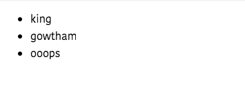
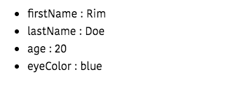

In this tutorial, we are going to learn about how to loop through the arrays and render a list of items in vuejs.


## V-for Directive

Vuejs offers us a `v-for` directive which is used to render a list of items into the dom.

The syntax of a v-for directive.

```html
v-for="user in users"
<!-- user variable is iterator -->
<!--users is data array-->
```
---
## Example

```html{4}
<template>
 <ul>
   <!-- list rendering starts -->
  <li v-for="user in users">{{user.name}}</li>
 </ul>
</template>

<script>
 export default{
     data:function(){
         return{
             users:[
                 {id:1,name:"king"},
                 {id:2,name:"gowtham"},
                 {id:3,name:"ooops"},
             ]
         }
     }
 }
</script>
```

In the above code, we are looping through the `users` array by using `v-for` directive, so that on each iteration `user` variable is pointing to the different object present inside the array.




## key attribute

When using `v-for` directive we need to add a `key` attribute to that element because vuejs needs to keep track the list items based on the provided key.

>Note: Key should be unique

Let's add the key attribute to our template.

```html{3}
<template>
 <ul>
  <li v-for="user in users" :key="user.id">
    {{user.name}}
  </li>
 </ul>
</template>

<script>
 export default{
     data:function(){
         return{
             users:[
                 {id:1,name:"king"},
                 {id:2,name:"gowtham"},
                 {id:3,name:"ooops"},
             ]
         }
     }
 }
</script>
```
In our `users` array `id` property is unique on every object so that we passed it to the key attribute.


We can also access the **index** of each item present in the array.

```html{3}
<template>
<ul>
  <li v-for="(user,index) in users" :key="user.id">
    {{user.name}} {{index}}
  </li>
 </ul>
</template>
```

## Looping through Objects

We can also loop through JavaScript objects by using __v-for__ directive.


```html{4}
<template>
  <ul>
    <!-- accessing `value and key` present in person object -->
    <li v-for="(value, key) in person" :key="key">
      {{key}} : {{ value }}
    </li>
  </ul>
</template>

<script>
export default {
  data: function() {
    return {
      person: {
        firstName: "Rim",
        lastName: "Doe",
        age: 20,
        eyeColor: "blue"
      }
    };
  }
};
</script>
```




>Note: In Objects we need to extract  `value` first then `key` it's doesn't work if you interchange it.