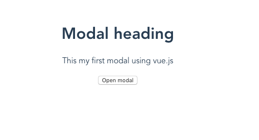
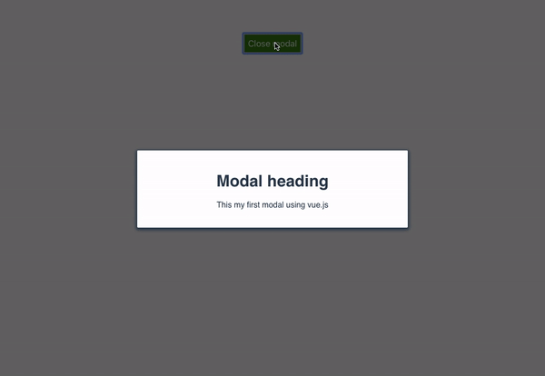

In this tutorial, we are going to learn about how to create a modal component with Vue.js.


## Getting Started

This tutorial assumes that you already created a new vue project by using [Vue-cli](/vue-cli3-tutorial-creating-project/)


Let's create a new component called `Modal.vue` in your components folder.

```html:title=Modal.vue
<template>
   <div>
      <div v-if="isOpen">
          <h1>Modal heading</h1>
          <p>This my first modal using vue.js</p>
      </div>
      <button @click="isOpen=!isOpen">Open modal</button>
   </div>
</template>


<script>
   export default{
       data:function(){
          return {
      isOpen: false
    };
       }
   }
</script>
```
Here we created our modal template with two `div` tags and one `button` element. The `button` is used to open our modal.

In our second `div` tag we added a `v-if=isOpen` directive so that our modal will only display if `isOpen` property is true.


Let's test our modal don't worry we will add styles and transitions too.

If we toggle on a `Open modal` button our modal will display.




## Adding styles and transitions

Vue offers us a custom `transition` element which helps us to add and remove the transitions to our HTML elements.

Let's add the styles and transitions to our `Modal` component.


```html{3}:title=Modal.vue
<template>
  <div>
    <transition name="modal">
      <div v-if="isOpen">
        <div class="overlay" @click.self="isOpen = false;">
          <div class="modal">
            <h1>Modal heading</h1>
            <p>This my first modal using vue.js</p>
          </div>
        </div>
      </div>
    </transition>
    <button @click="isOpen = !isOpen;">
      {{ isOpen ? "Close" : "Open" }} modal
    </button>
  </div>
</template>

<script>
export default {
  data: function() {
    return {
      isOpen: false
    };
  }
};
</script>

<style scoped>
.modal {
  width: 500px;
  margin: 0px auto;
  padding: 20px;
  background-color: #fff;
  border-radius: 2px;
  box-shadow: 0 2px 8px 3px;
  transition: all 0.2s ease-in;
  font-family: Helvetica, Arial, sans-serif;
}
.fadeIn-enter {
  opacity: 0;
}

.fadeIn-leave-active {
  opacity: 0;
  transition: all 0.2s step-end;
}

.fadeIn-enter .modal,
.fadeIn-leave-active.modal {
  transform: scale(1.1);
}
button {
  padding: 7px;
  margin-top: 10px;
  background-color: green;
  color: white;
  font-size: 1.1rem;
}

.overlay {
  position: fixed;
  top: 0;
  left: 0;
  display: flex;
  justify-content: center;
  align-items: center;
  width: 100%;
  height: 100%;
  background: #00000094;
  z-index: 999;
  transition: opacity 0.2s ease;
}
</style>
```

In the above code, we wrapped our `modal` with `transition` element.

**transition**: In transition element, we need to add a `name` attribute with transition name.

Let test our modal again.




Have you seen we have also added an `overlay` to our modal with `click` listener so that we can close our modal by clicking on the overlay?