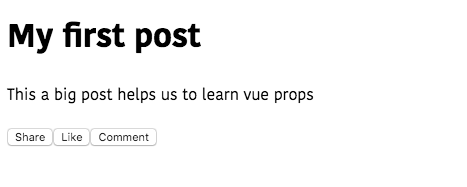
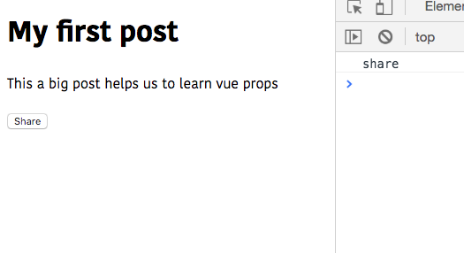

In this tutorial, we are going to learn about how to use props
in vue.js apps with the help of examples.


## Props

In Vue.js props helps us to pass the data to its child components.


## Registering props

To use the props in Vue components first we need to register the props.

Let's create a new component called Button.

```html{2,7}:title=Button.vue
<template>
  <button>{{name}}</button>
</template>

<script>
 export default{
     props:['name']
 }
</script>
```

In the above code, we have registered a prop called `name` inside the `props` array. The registered props can be used inside the template just like data properties.

## Passing the data to the props

So far we have registered a prop inside the Button Component, let's pass the data to that prop.

Now we can pass the data to that prop as a custom HTML `name` attribute.

```html{5-7}:title=Post.vue
<template>
  <div>
    <h1>My first post</h1>
    <p>This a big post helps us to learn vue props</p>
    <my-button name="Share"></my-button>
    <my-button name="Like"></my-button>
    <my-button name="Comment"></my-button>
  </div>
</template>

<script>
  import Button from './Button.vue'
  export default{
    components:{
        'my-button':Button
    }
  }
</script>
```




## Passing functions to the props

Let's register a second prop to our `Button` component.

```html{2,7}:title=Button.vue
<template>
  <button @click="handleClick">{{ name }}</button>
</template>

<script>
export default {
  props: ["name", "handleClick"]
};
</script>
```
Here we registered a `handleClick` prop which is attached to the `@click` event of the button. Now we need to pass the function as a prop to the `Button` so that it handles the click event.

```html{5}:title=Post.vue
<template>
  <div>
    <h1>My first post</h1>
    <p>This a big post helps us to learn vue props</p>
    <my-button name="Share" :handleClick="shareMe"></my-button>
  </div>
</template>

<script>
import Button from "./components/Button.vue";
export default {
  components: {
    "my-button": Button
  },
  methods: {
    shareMe: function() {
        //write your logic
      console.log("share");
    }
  }
};
</script>
```
Inside the template we passed the `shareMe` function to our `:handleClick` prop.

>for dynamic values we need to use colon `:propname` instead of `propname` otherwise Vue treated it as JavaScript string.



## Validating props

So far we are registering props by using an array but there is a second way to register and validate props by using object syntax.

Let's validate props present inside our `Button` component.

```html{7-16}:title=Button.vue
<template>
  <button @click="handleClick">{{ name }}</button>
</template>

<script>
export default {
  props: {
    name:{
      required:true,
      type:String
    },
    handleClick:{
      required:true,
      type:Function
    }
  }
};
</script>
```

Here we added two properties which are `required` and `type` of data the prop is accepting.


Now if we fail to pass the data to that prop Vue.js shows us an error inside our browser's console.


## Available Type checks

```bash
The type can be one of the following native constructors:

String
Number
Boolean
Array
Object
Date
Function
Symbol
```
