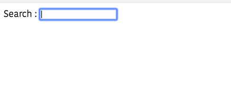

In this tutorial, we are going to learn about how to access the dom nodes in VueJS by using `refs`.


## Refs

If we add `ref` attribute to any HTML element inside the template that can be accessed in `vue` instance with `$refs` property.


Let's see an example.

```html{4,15}
<template>
  <div>
     <label for="box">Search : </label>
    <input ref="search" v-model="query" id="box" />
  </div>
</template>

<script>
export default {
  data: function() {
    return {
      query: ""
    };
  },
  mounted: function() {
    this.$refs["search"].focus();
  }
};
</script>
```
In the above code, we have added `ref` atrribute to `input` element so that we accessed it inside the `mounted` lifecycle hook with `this.$refs['search']`.

Whenever a user opens our `app` we are focussing the input `placeholder` like  **Google search box**.


