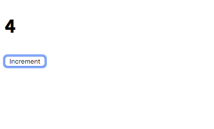

In this tutorial, we are going to learn about how to manage the state in vuejs apps by using the vuex library.

## What is Vuex?

Vuex is state management library created by the Vue core team which helps us to manage the centralized state in vue apps it means we can maintain our whole app state in one place.


## Why we need Vuex?

In large apps, it's hard to maintain the app state in components and share data between other components by using `props` which is often unpredictable, so that we need the 'vuex'  to create a centralized state.

## Getting started

>This tutorial assumes that you already installed [vue cli](/vue-cli3-tutorial-creating-project/) in your pc.

Let's create a new vue app by running the following command in your terminal.

```bash
vue create learn-vuex && cd $_
```

This above command creates a new vue project inside `learn-vuex` folder and also change your current working directory to `learn-vuex`.


## Installing Vuex

Let's install the `vuex` library by running the below command.

```bash
npm i vuex
```

## Creating vuex store

Once you successfully installed the `vuex`library now open your `learn-vuex` folder in your favorite
code editor and create a new file called `store.js` in your `src` folder.

In the above code, we have imported a 'vuex' library and telling vue to use `Vuex` library.

```js:title=store.js
import Vue from 'vue';
import Vuex from 'vuex';

Vue.use(Vuex);

export const store = new Vuex.Store({});
```
The `store` is holding our whole app state in a reactive JavaScript object it means if we update in a state in one place it will also update state in other places we used it.


To access the store object inside your vue components we need to pass the store to our root vue instance present inside  `main.js` file.

```js{5,8}:title=main.js
import Vue from 'vue'
import App from './App.vue'
import { store } from './store';

Vue.config.productionTip = false

new Vue({
  store,
  render: h => h(App),
}).$mount('#app')
```

Let's add a  console.log inside our `App.vue` file  to see if vuex `store` is available in vue components.

```html{8}:title=App.vue
<template>
  <div id="app"></div>
</template>

<script>
export default {
  created: function() {
    console.log(this.$store);
  }
};
</script>
```


So far we just created a vuex store but we didn't add any state to our store let's add it now.

## Adding state to  Vuex store

The `state` is a reserved property in vuex, which is an object where we can add our app initial state.

Let's update our `store.js` file by adding the state.

```js{7-9}:title=store.js
import Vue from 'vue';
import Vuex from 'vuex';

Vue.use(Vuex);

export const store = new Vuex.Store({
    state: {
        count: 0
    }
});
```

## Accessing the state

Now we can access the state inside our vue components by creating a computed property.

```html{3,9-13}:title=App.vue
<template>
  <div id="app">
    <h1>{{count}}</h1>
  </div>
</template>

<script>
export default {
  computed: {
    count: function() {
      return this.$store.state.count;
    }
  }
};
</script>
```

## Adding mutations to Vuex store

In vuex, we can't directly update state directly the only way to update the state is by adding a mutation.

>Note: Mutations work in synchronous fashion.

Let's add an `INCREMENT_COUNT` mutation which is used to update our `count` value by '1'.

```js{10-14}:title=store.js
import Vue from 'vue';
import Vuex from 'vuex';

Vue.use(Vuex);

export const store = new Vuex.Store({
    state: {
        count: 0
    },
    mutations: {
        INCREMENT_COUNT(state) {
            state.count += 1
        }
    }
});
```

Every mutation function will receive `state` as its first parameter.

Now we can invoke the mutation function inside our vue component by running a `commit` method with an argument `mutation name`.

```html{4,16-19}:title=App.vue
<template>
  <div id="app">
    <h1>{{count}}</h1>
    <button @click="increment">Increment</button>
  </div>
</template>

<script>
export default {
  computed: {
    count: function() {
      return this.$store.state.count;
    }
  },
  methods: {
    increment() {
        //invoking the 'INCREMENT_COUNT' mutation
      this.$store.commit("INCREMENT_COUNT");
    }
  }
};
</script>
```



## Passing dynamic arguments to mutations

We can also pass dynamic arguments to the mutations at the time of committing a mutation.

Let's update our `INCREMNT_COUNT` mutation in `store.js` file so that it can accept dynamic arguments.

```js{10-14}:title=store.js
import Vue from 'vue';
import Vuex from 'vuex';

Vue.use(Vuex);

export const store = new Vuex.Store({
    state: {
        count: 0
    },
    mutations: {
        INCREMENT_COUNT(state, value) {
            state.count += value
        }
    }
});
```
Now inside our vue component we can commit a `INCREMENT_COUNT` mutation by passing a `value`.


```html{4,16-19}:title=App.vue
<template>
  <div id="app">
    <h1>{{count}}</h1>
    <button @click="increment">Increment</button>
  </div>
</template>

<script>
export default {
  computed: {
    count: function() {
      return this.$store.state.count;
    }
  },
  methods: {
    increment() {
        //commiting the mutation by passing a value 2
      this.$store.commit("INCREMENT_COUNT",2);
    }
  }
};
</script>
```

Now, if we click on the `increment` button it will increment the `count` value by 2.


## Actions in vuex

In vuex `mutations` are synchronous so that **actions** helps us to run asynchronous tasks like making an API request.

Let's add actions to our `vuex` store which helps us to make an API request.

Every action function will receive a `context` object as its parameter by using this we can `commit` the mutations directly from the actions and also we can access the `state`.

```js{9,15-18,21-27}:title=store.js
import Vue from 'vue';
import Vuex from 'vuex';

Vue.use(Vuex);

export const store = new Vuex.Store({
    state: {
        count: 0,
        todo: null
    },
    mutations: {
        INCREMENT_COUNT(state, value) {
            state.count += value
        },
        SET_TODO(state, data) {
            state.todo = data
        }

    },
    actions: {
        getTodo(context) {
            fetch('https://jsonplaceholder.typicode.com/todos/1')
                .then(response => response.json())
                .then(firstTodo => {
                    context.commit('SET_TODO', firstTodo)
                })
        }
    }
});
```

## Dispatching actions

To invoke the `actions` inside vue components  we need to use `this.$store.dispatch` method.

```js{6,8,19-21,27-29}:title=App.vue
<template>
  <div id="app">
    <h1>{{count}}</h1>
    <button @click="increment">Increment</button>
    <hr>
    <button @click="getTodo">Get todo</button>
    <ul>
      <li v-for="(value,key) in todo" :key="key">{{value}}</li>
    </ul>
  </div>
</template>

<script>
export default {
  computed: {
    count: function() {
      return this.$store.state.count;
    },
    todo: function() {
      return this.$store.state.todo;
    }
  },
  methods: {
    increment() {
      this.$store.commit("INCREMENT_COUNT", 2);
    },
    getTodo() {
      this.$store.dispatch("getTodo");
    }
  }
};
</script>
```


**[Code repository](https://github.com/saigowthamr/learn-vuex-vuejs-)**