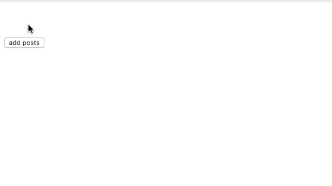

In this tutorial, we are going to learn about Transitions in vuejs with examples.


## transition component

Vue provides us a `<transition>` wrapper component which helps us to apply transitions to html elements
whenever an element is added or removed from the dom.

In `<transition>` component we need to add an attribute called `name`.

**name**: The name of the transition CSS class.

whenever we added a `name` to our transition component vuejs gives us different css classes prefixed with `name`.

>`*` represents the name of your `transition` class.

***-enter** : Initial state, this class is added one frame before our element is inserted, removed one frame after the element is inserted.

***-enter-active**: This class is Applied during the entering phase. Added before an element is inserted, removed when transition/animation finishes. This class can be used to define the duration, delay and easing curve for the entering transition.

***-enter-to**: Ending state for `*-enter` class. Added one frame after the element is inserted (at the same time *-enter is removed), removed when transition/animation finishes.

***-leave**: Added immediately when an element is leaving from the dom, removed after one frame.

***-leave-active**: Active state for leave. Applied during the entire leaving phase. Added immediately when leave transition is triggered, removed when the transition/animation finishes. This class can be used to define the duration, delay and easing curve for the leaving transition.

***-leave-to**: Ending state for `*-leave` class. Added one frame after a leaving transition is triggered (at the same time *-leave is removed), removed when the transition/animation finishes.


## Example

```html{4,21-28}
<template>
  <div id="app">
    <button @click="show = !show;">Show</button>
    <transition name="slide">
       <h1 v-if="show">Vue transition</h1>
    </transition>
  </div>
</template>

<script>
export default {
  data: function() {
    return {
      show: false
    };
  }
};
</script>

<style>
.slide-enter-active,
.slide-leave-active {
  transition: transform 0.4s ease;
}
.slide-enter,
.slide-leave-to {
  transform: translateY(-50%);
}
</style>
```

In the above example, we wrapped our `h1` element with `transition` component having `name="slide"`.

Inside our `style` tags we added four classes.

**.slide-enter**:This class is applied one frame before our `h1` element is added to the dom.

The `.slide-enter-active` and `.slide-leave-active` classes are applying transitions to our `h1` element.


## Transitions on Initial render

Sometimes we need to apply a transition to our `elements` when a page is Initially rendered into the dom in such cases we need to add a `appear` attribute to `transition` component.

```html{3}:title=Example.vue
<template>
  <div id="app">
    <transition appear name="slide">
      <h1>Vue transitions</h1>
    </transition>
  </div>
</template>

<script>
export default {};
</script>

<style>
.slide-enter-active {
  transition: transform 0.4s ease;
}
.slide-enter {
  transform: translateY(-50%);
}
</style>

```


## Transitioning List items

For transitioning list items we need to use `<transition-group>` component, by default `transition-group` wraps our list items with `span` tag.

We can change the `default` tag by adding the `tag` attribute to `transition-group` component.


```html{3}:title=List.vue
<template>
  <div>
    <transition-group name="list" tag="ul">
      <li v-for="(post, i) in posts" :key="i">{{ post.title }}</li>
    </transition-group>
    <button @click="addPosts">add posts</button>
  </div>
</template>

<script>
export default {
  data: function() {
    return {
      posts: []
    };
  },
  methods: {
    addPosts: function() {
      this.posts.push({
        title: `${Math.floor(Math.random() * 10 + 1)} post`
      });
    }
  }
};
</script>

<style>
.list-enter-active,
.list-leave-active {
  transition: all 1s;
}
.list-enter, .list-leave-to  {
  opacity: 0;
  transform: translateX(-50%);
}
</style>
```

