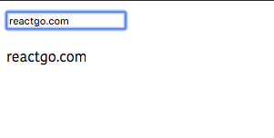

In this tutorial we are going to learn about two-way data binding in vuejs
by using v-model directive.


## What is V-model directive ?

v-model directive helps us to create two way data binding on the form elements.


Let's see an example.

```html{2,10}
<template>
 <input v-model="name" placeholder="name"/>
  <p>{{name}}</p>
</template>

<script>
  export default{
      data:function(){
          return{
              name:""
          }
      }
  }
</script>
```

Here we bind the form input element to the `name` property using `v-model` so that when a `user` updates the `input` field it also updates the `name` property linked to it.




## Modifiers

v-model directive comes with a modifier options.


__.lazy__: By default v-model directive updates the data property on every keypress by adding
`.lazy` modifier it only updates after `change` event occurs.

```html
<template>
 <input v-model.lazy="name" placeholder="name"/>
</template>
```

__.trim__: It is used to remove the leading and trailing white spaces.

```html
<template>
 <input v-model.trim="name" placeholder="name"/>
</template>
```

__.number__: If you want to accept number to the `input` field then you need to use `.number` modifier.

```html
<template>
 <input v-model.number="age" placeholder="age"/>
</template>
```
