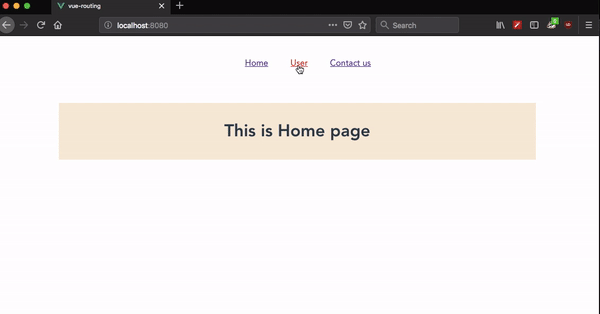
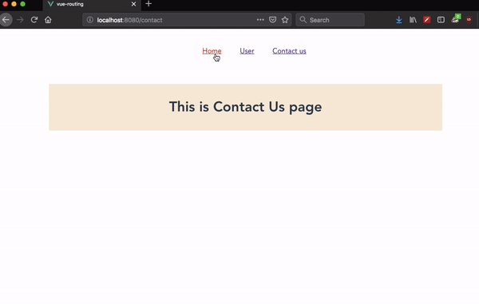

In this tutorial, we are going to learn about how to create transitions between routes in vue router.

Vue.js provides us a `<transistion>` component by wrapping that component with `<router-view>` we can easily add transitions to routes.

>Note: This tutorial assumes that you already familiar with Vue transitions. If you don't know about how transitions work in Vue then check out [Intro to Vue.js transitions](/vuejs-transitions-animations/)

```html{8-10}:title=App.vue
<template>
  <div id="app">
    <ul>
      <router-link to="/">Home</router-link>
      <router-link to="/user">User</router-link>
      <router-link to="/contact">Contact us</router-link>
    </ul>
    <transition>
      <router-view class="view"/>
    </transition>
  </div>
</template>

<script>
export default {};
</script>
```

In the above example, we wrapped our `<router-view>` component with `<transistion>` component but still we didn't see any transitions because we need to add a `name` attribute with `transition` class name to `<transistion>` component.


##  Slide transition example

```html{8,20-32}:title=App.vue
<template>
  <div id="app">
    <ul>
      <router-link to="/">Home</router-link>
      <router-link to="/user">User</router-link>
      <router-link to="/contact">Contact us</router-link>
    </ul>
    <transition name="slide" mode="out-in">
      <router-view class="view"/>
    </transition>
  </div>
</template>

<script>
export default {};
</script>

<style>

/*slide transition*/

.slide-enter-active,
.slide-leave-active {
  transition: transform 0.4s ease-out;
}
.slide-enter {
  transform: translateX(-30%);
}

.slide-leave-to {
  transform: translateX(30%);
}
</style>
```

Here we also added `mode='out-in'` attribute where `out-in` means the old component is removed first before adding a new component.




## Flip transition example

Let's add a  `flip` transition effect to our routes by removing `slide` transition.

```html{8,20-32}:title=App.vue
<template>
  <div id="app">
    <ul>
      <router-link to="/">Home</router-link>
      <router-link to="/user">User</router-link>
      <router-link to="/contact">Contact us</router-link>
    </ul>
    <transition name="flip" mode="out-in">
      <router-view class="view"/>
    </transition>
  </div>
</template>

<script>
export default {};
</script>

<style>
/*flip transition*/
.flip-enter-active,
.flip-leave-active {
  transition: transform 0.3s ease-out;
}
.flip-enter {
  transform: rotateY(90deg);
}

.flip-leave-to {
  transform: rotateY(90deg);
}
</style>
```

