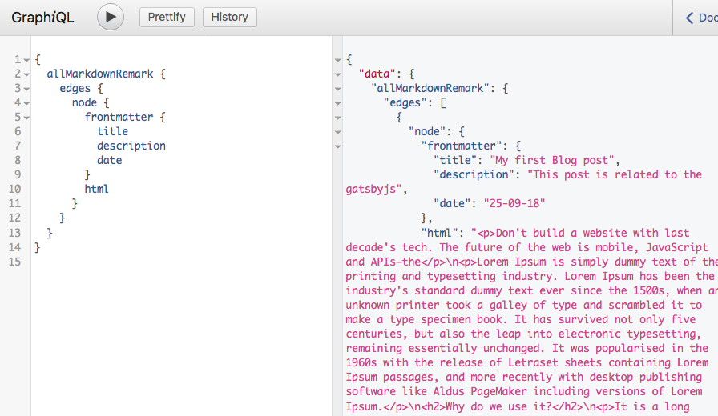
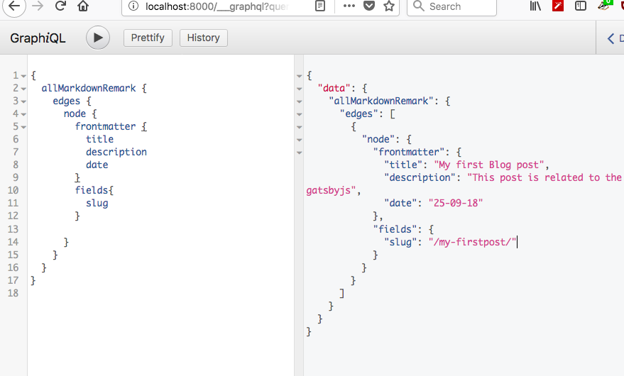
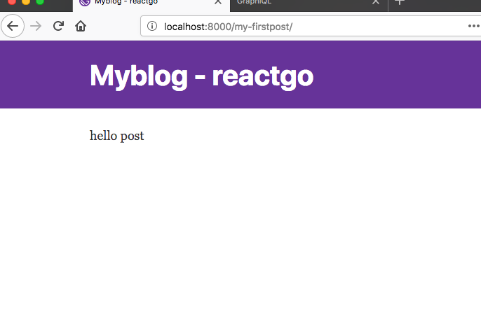
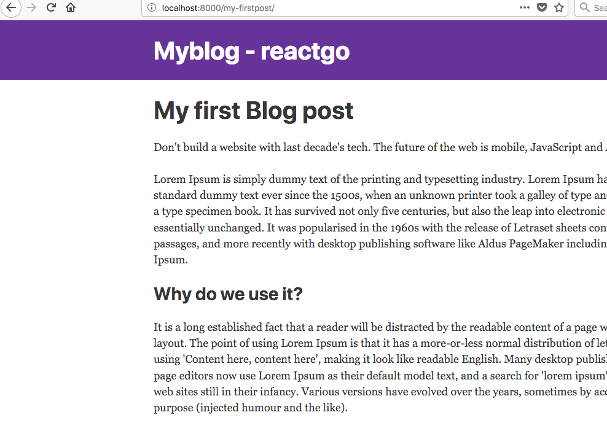

In this tutorial, we are adding some blog posts to our blog with the help of markdown
which is most commonly used format to write the posts.

Now create a `my-firstpost/index.md` folder inside the pages directory.

`my-firstpost/index.md`

Our post should have a title, description,date, and image.

```markdown
---
title: My first Blog post
description: This post is related to the gatsbyjs
date: '2018-09-26'
image: ''
---

Don't build a website with last decade's tech. The future of the web is mobile,
 JavaScript and APIs—the

Lorem Ipsum is simply dummy text of the printing and typesetting industry.
Lorem Ipsum has been the industry's standard dummy text ever since the 1500s,
when an unknown printer took a galley of type and scrambled it to make a type s
pecimen book. It has survived not only five centuries, but also the leap into
electronic typesetting, remaining essentially unchanged. It was popularised in
the 1960s with the release of Letraset sheets containing Lorem Ipsum passages,
and more recently with desktop publishing software like Aldus PageMaker including
versions of Lorem Ipsum.

## Why do we use it?

It is a long established fact that a reader will be distracted by the readable
content of a page when looking at its layout. The point of using Lorem Ipsum
is that it has a more-or-less normal distribution of letters, as opposed to using
'Content here, content here', making it look like readable English.
Many desktop publishing packages and web page editors now use Lorem
Ipsum as their default model text and a search for 'lorem ipsum' will
uncover many web sites still in their infancy. Various versions have evolved
over the years, sometimes by accident, sometimes on purpose
(injected humor and the like).
```

we need to query this Markdown data by using the graphql for this first we need to install the
two new plugins which help us to transform the Markdown data into the html format.

 - gatsby transformer remark.
 - gatsby-source-filesystem

```bash
npm install  gatsby-transformer-remark
npm install  gatsby-source-filesystem
```


Now we need to tell the Gatsby to use this two plugins.

Open your gatsby-config.js file and add the below config.

_gatsby-config.js_
```js
module.exports = {
  siteMetadata: {
    title: 'Myblog - reactgo',
  },
  plugins: [
    'gatsby-plugin-react-helmet',
    {
      resolve: `gatsby-plugin-manifest`,
      options: {
        name: 'gatsby-starter-default',
        short_name: 'starter',
        start_url: '/',
        background_color: '#663399',
        theme_color: '#663399',
        display: 'minimal-ui',
        icon: 'src/images/gatsby-icon.png', // This path is relative to the root of the site.
      },
    },
    `gatsby-transformer-remark`,
    'gatsby-plugin-offline',
    {
      resolve: `gatsby-source-filesystem`,
      options: {
        path: `${__dirname}/src/pages`,
        name: "pages",
      },
    },
  ],
}
```
Once you added now restart the server using `gatsby develop`

Let's query a data using GraphiQL

```graphql
{
  allMarkdownRemark {
    edges {
      node {
        frontmatter {
          title
          description
          date
        }
        html
      }
    }
  }
}
```

You will see the same data that we added to our post.




Open *gatsby-node.js*

First, we need to add a new field to our query which is a slug field. onCreateNode API is used to create the new node fields.

*gatsby-node.js*
```js
const path = require("path")
const { createFilePath, createFileNode } = require(`gatsby-source-filesystem`);

exports.onCreateNode = ({ node, getNode, actions }) => {
    const { createNodeField } = actions
    if (node.internal.type === `MarkdownRemark`) {
        const slug = createFilePath({ node, getNode, basePath: `pages` })
        createNodeField({
            node,
            name: `slug`,
            value: slug,
        })

    }
}
```




## Creating pages programmatically  using createPages API

*gatsby-node.js*

```js
const path = require("path")
const { createFilePath, createFileNode } = require(`gatsby-source-filesystem`)

exports.createPages = ({ actions, graphql }) => {
    const { createPage } = actions

    const blogPostTemplate = path.resolve(`src/templates/blog-post.js`)

    return new Promise((resolve, reject) => {

        resolve(graphql(`
    {
      allMarkdownRemark(
        sort: { order: DESC, fields: [frontmatter___date] }
        limit: 1000
      ) {
        edges {
          node {
              fields{
                  slug
              }
            frontmatter {
              title
            }
          }
        }
      }
    }
  `).then(result => {
                if (result.errors) {
                    console.log(result.errors)
                    return reject(result.errors)
                }

                const blogTemplate = path.resolve('./src/templates/blog-post.js');

                result.data.allMarkdownRemark.edges.forEach(({ node }) => {
                    createPage({
                        path: node.fields.slug,
                        component: blogTemplate,
                        context: {
                            slug: node.fields.slug,
                        }, // additional data can be passed via context
                    })
                })
                return
            })
        )
    })
}


exports.onCreateNode = ({ node, getNode, actions }) => {
    const { createNodeField } = actions
    if (node.internal.type === `MarkdownRemark`) {
        const slug = createFilePath({ node, getNode, basePath: `pages` })
        createNodeField({
            node,
            name: `slug`,
            value: slug,
        })

    }
}
```

we need to tell the gatsby to use the particular template for the blog posts so
that gatsby reuses this template for every blog post we write.


Let's create a blog post template now.

_templates/blog-post.js_

```js
import React from 'react';
import Layout from '../components/layout';

function BlogPost() {
    return (
        <Layout>
            <div>
                hello post
        </div>
        </Layout>
    )
}

export default BlogPost
```

Now delete `.cache` folder and run the `gatsby develop`

If you navigate over to the `localhost:8000/my-fristpost` you will see a Blog post template is rendered on the screen.




It's time to add a query to our BlogPost template.

*blog-post.js*

```js
import React from 'react';
import Layout from '../components/layout';
import { graphql } from 'gatsby'

function BlogPost() {
    return (
        <Layout>
            <div>
                hello post
        </div>
        </Layout>
    )
}

export default BlogPost

const query = graphql`
 query PostQuery($slug: String!) {
     markdownRemark(fields: { slug: { eq: $slug } }) {
       html
       frontmatter {
        title
        description
       }
   }
`
```

We are querying the data with the help of variable called $slug the same slug field which we added in the context object inside the **createPage** method.

The data of this query is available to us  in `props.data`


_blog-post.js_
```js
import React from 'react';
import Layout from '../components/layout';
import { graphql } from 'gatsby'

function BlogPost(props) {

    const post = props.data.markdownRemark;
    const { title } = post.frontmatter;

    return (
        <Layout>
            <div>
                <h1>{title}</h1>
                <div dangerouslySetInnerHTML={{ __html: post.html }} />
            </div>
        </Layout>
    )
}


export default BlogPost;

export const query = graphql`

 query PostQuery($slug: String!) {
     markdownRemark(fields: { slug: { eq: $slug } }) {
       html
       frontmatter {
        title
        description
       }
   }
}`
```

Now you can see a  post is rendered on the screen.


