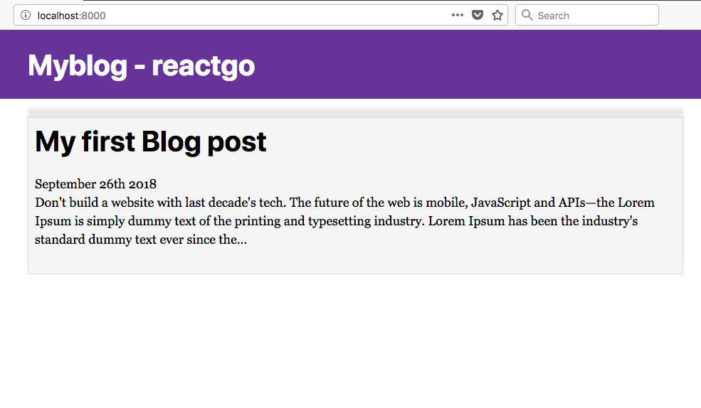
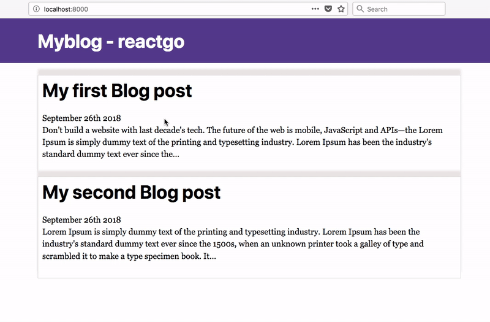

So far we didn't display any posts on the index page in this tutorial we are going to display the posts list in the index page.

Open your  `index.js` file and add the below query to get the available posts.

_index.js_

```js
import React from 'react'
import { Link, graphql } from 'gatsby'
import './post.css';
import Layout from '../components/layout'

const IndexPage = (props) => {
  const postList = props.data.allMarkdownRemark;
  return (
    <Layout>
      {postList.edges.map(({ node }, i) => (
        <Link to={node.fields.slug} className="link" >
          <div className="post-list">
            <h1>{node.frontmatter.title}</h1>
            <span>{node.frontmatter.date}</span>
            <p>{node.excerpt}</p>
          </div>
        </Link>
      ))}
    </Layout>
  )
}

export default IndexPage;

export const listQuery = graphql`
  query ListQuery {
    allMarkdownRemark(sort: { order: DESC, fields: [frontmatter___date] }) {
      edges {
        node {
          fields{
            slug
          }
          excerpt(pruneLength: 250)
          frontmatter {
            date(formatString: "MMMM Do YYYY")
            title
          }
        }
      }
    }
  }
`
```

Now open your browser you will see a posts list on the index page.



Let's add a second post to our blog.

_second-post/index.md_

```md
---
title: My second Blog post
description: This post is related to the gatsbyjs
date: '2018-09-26'
image: ''
---

Lorem Ipsum is simply dummy text of the printing and typesetting industry.
Lorem Ipsum has been the industry's standard dummy text ever since the 1500s,
when an unknown printer took a galley of type and scrambled it to make a type
specimen book. It has survived not only five centuries, but also the leap into
electronic typesetting, remaining essentially unchanged. It was popularised in
the 1960s with the release of Letraset sheets containing Lorem Ipsum passages,
and more recently with desktop publishing software like Aldus PageMaker
including versions of Lorem Ipsum.

## Why do we use it?

It is a long established fact that a reader will be distracted by the
readable content of a page when looking at its layout. The point of using
Lorem Ipsum is that it has a more-or-less normal distribution of letters,
as opposed to using 'Content here, content here', making it look like readable
English. Many desktop publishing packages and web page editors now use Lorem Ipsum
as their default model text, and a search for 'lorem ipsum' will uncover many web
sites still in their infancy. Various versions have evolved over the years, sometimes
by accident, sometimes on purpose (injected humor and the like).
```

Restart the development server you will see two posts.



