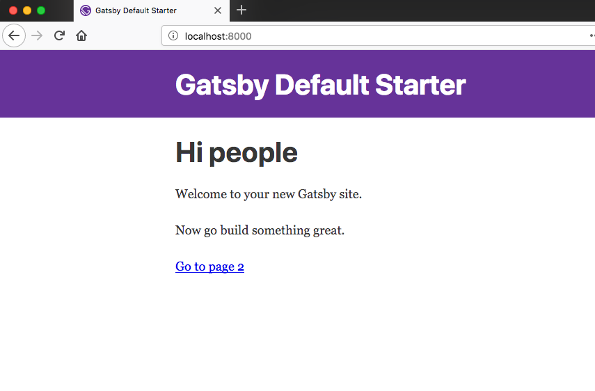
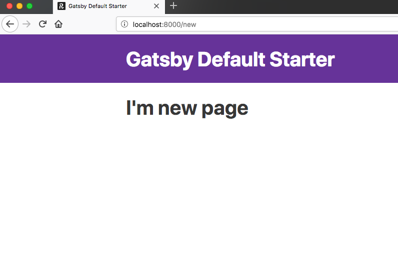

In this tutorial, We are going to set up a development environment for the blog we are building.

<blockquote>
Nodejs is required for this project if you don't have nodejs then go to nodejs.org and download the version which suits for your operating system.Once you installed then open your terminal and run node --v if the version number is shown then you are successfully installed.
</blockquote>

*Note: If you stuck in the middle of this tutorial please refer to the [Code repository](https://github.com/saigowthamr/gatsbyblog-starter) it's already on GitHub*.


Let’s install the gatsby-cli which helps us to create and build new Gatsby sites right
from the terminal.

Open your terminal and run below commands.

```bash
npm install --global gatsby-cli
```

If you are using a mac then you need use **sudo** before the npm.

```bash
sudo npm install --global gatsby-cli
```

Once you successfully installed gatsby-cli it's time to see the Gatsby first look.

Open your terminal and run the following commands.

```bash
gatsby new myblog
```


```
cd myblog
gatsby develop
```
`gatsby develop` is used to start the local development server by default Gatsby uses the port 8000.

Now open your browser and type `localhost:8000` you will see a Gatsby index page.




Open the myblog folder in your favorite code editor.

Folder structure might look like these.

```bash
├── node_modules
├── src
├── .gitignore
├── .prettierrc
├── gatsby-browser.js
├── gatsby-config.js
├── gatsby-node.js
├── gatsby-ssr.js
├── LICENSE
├── package-lock.json
├── package.json
├── README.md
```

**node_modules**: The packages we are installed using npm will live in a node_modules folder.

**src**: Main code lives in src folder.

**gatsby-browser.js**: This file is related to the usage of any browser-related APIs provided by the gatsbyjs.

**gatsby-node.js** This file is related to the usage of any node related APIs provided by the gatsbyjs.


Open your pages folder any file you create in the pages folder treated as an individual page in the Gatsby.

suppose create a  **new.js** file in your pages folder.

_pages/new.js_

```js
import React from 'react'
import Layout from '../components/layout'

const NewPage = () => (
    <Layout>
        <h1>I'm new page</h1>
    </Layout>
)

export default NewPage
```

Now in your browser manually type `localhost:8000/new` you will see a  `new`  route which is created by the Gatsby.



In the next tutorial, we are using the graphql to query the data.