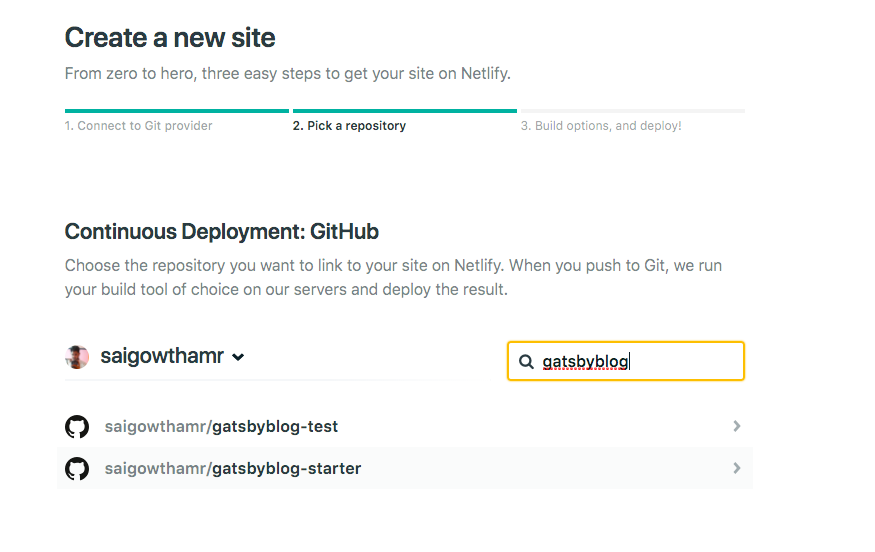
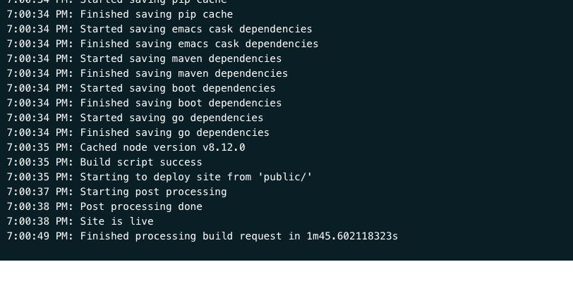
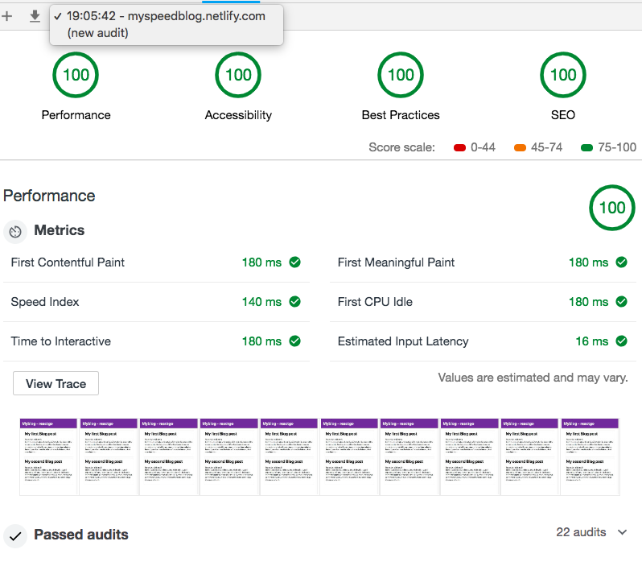

We are using the netlify to host our blog because netlify offers a free tier for the personal blogs and projects with the custom domain support, HTTPS and continuous deployment from the private or public repositories.

Netlify is the best option to host the static sites its global CDN helps to serve the pages and assets quickly.

First, we need to create the account in netlify once you signed in you will see a button **new site from git** click on that button and select your code repository.

My code is already on the GitHub so that i will choose the GitHub option for the continuous deployment then we need to select a code repository as i showed in the below image.

The last step click on the deploy site button then netlify robots start deploying your site.

[Checkout Live Blog](https://myspeedblog.netlify.com/)

 we are auditing our blog now by using chrome dev tools open your site in the Chrome browser and open the dev tools by hitting `cmd+opt+i`  in mac or just right click and choose to inspect and select the audits tab then click on run audits button.

Have you seen everything is 100% performance, accessibility, best practices and seo hope you enjoyed and learned something new?

[Code repository](https://github.com/saigowthamr/gatsbyblog-starter)

[Live Blog](https://myspeedblog.netlify.com/)