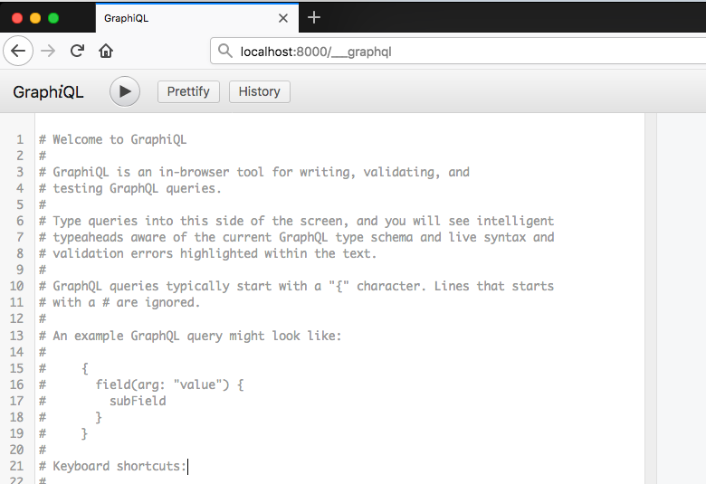
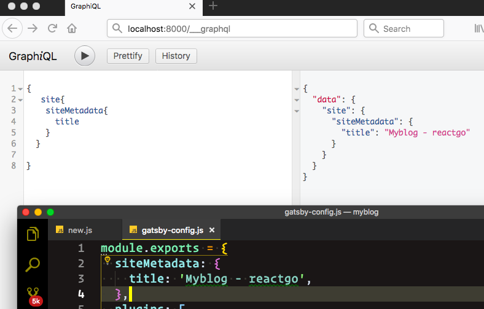
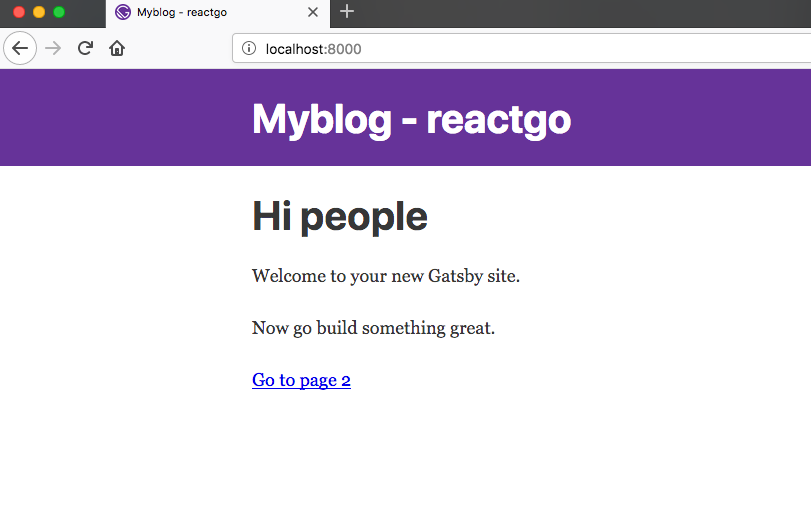

Gatsby uses the graphql for querying the data from the different data resources if you don't know about graphql don't worry we will learn something about graphql as we go.


Now open your  gatsby-config.js file and just change the title of the blog as i did in the below code.

_gatsby-config.js_

```js
module.exports = {
  siteMetadata: {
    title: 'Myblog - reactgo',
  },
  plugins: [
    'gatsby-plugin-react-helmet',
    {
      resolve: `gatsby-plugin-manifest`,
      options: {
        name: 'gatsby-starter-default',
        short_name: 'starter',
        start_url: '/',
        background_color: '#663399',
        theme_color: '#663399',
        display: 'minimal-ui',
        icon: 'src/images/gatsby-icon.png', // This path is relative to the root of the site.
      },
    },
    'gatsby-plugin-offline',
  ],
}

```

If you run a  gatsby develop you will see two urls one is `localhost:8000`
and other is `localhost:8000/___graphql`.

Now open your browser and enter  `localhost:8000/___graphql`.You will see a GraphiQL interface.



Let's write some queries now by using GraphiQL.


```graphql
{
   site{
    siteMetadata{
      title
    }
  }
}
```
If you hit play button now you will see the same data which we write before inside the `gatsby.config.js` file.




Have you seen our blog title is changed now?



Now Open your components folder layout.js file you will see a StaticQuery
which is querying for the `site title` the data which comes back from the query is stored inside the `data` property.

_layout.js_
```js
import React from 'react'
import Helmet from 'react-helmet'
import { StaticQuery, graphql } from 'gatsby'

import Header from './header'
import './layout.css'

const Layout = ({ children }) => (
  <StaticQuery
    query={graphql`
      query SiteTitleQuery {
        site {
          siteMetadata {
            title
          }
        }
      }
    `}
    render={data => (
      <>
        <Helmet
          title={data.site.siteMetadata.title}
          meta={[
            { name: 'description', content: 'Sample' },
            { name: 'keywords', content: 'sample, something' },
          ]}
        >
          <html lang="en" />
        </Helmet>
        <Header siteTitle={data.site.siteMetadata.title} />
        <div
          style={{
            margin: '0 auto',
            maxWidth: 960,
            padding: '0px 1.0875rem 1.45rem',
            paddingTop: 0,
          }}
        >
          {children}
        </div>
      </>
    )}
  />
)

export default Layout
```


In next tutorial, we are writing our first blog post in Markdown format.

