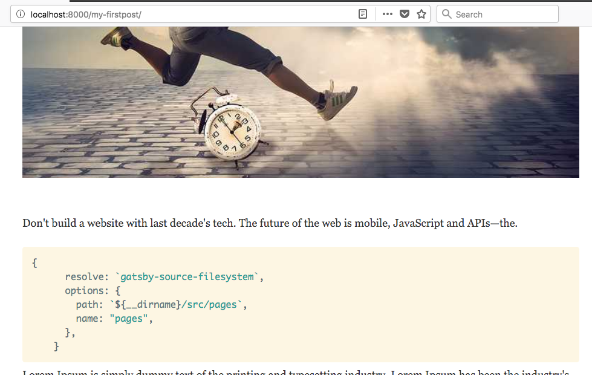

In this tutorial, we are going to learn how to add a syntax highlighting to the code blocks by using the prismjs plugin.

Run below commands to install prismjs.

```bash
npm install --save gatsby-remark-prismjs prismjs
```

Once you successfully installed now open gatsby-config.js and add the below configuration to the
plugins array.

_gatsby-conifg.js_

```js
{
    resolve: `gatsby-transformer-remark`,
    options: {
      plugins: [
        `gatsby-remark-prismjs`,
      ]
    }
  }
```

next, we need to the choose the syntax theme provided by the prismjs

_gatsby-browser.js_

```js
require("prismjs/themes/prism-solarizedlight.css")
```

Let's test it now by adding some code blocks to our Markdown files.

*my-firstpost/index.md*

```js

```js
{
      resolve: `gatsby-source-filesystem`,
      options: {
        path: `${__dirname}/src/pages`,
        name: "pages",
      },
    }
```


