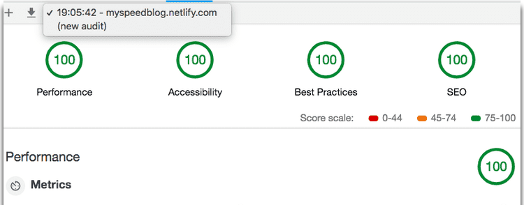

In this tutorial series, we are building a blazing speed blog with SEO, offline support and free hosting using gatsby.js which is a static site generator built on top of the react.

[Live blog](https://myspeedblog.netlify.com/)

### Table of contents.

- [Introduction to Gatsby](/gatsbyblog/introductiongatsby/)
- [Getting started with Gatsby](/gatsbyblog/gettingstarted/)
- [Querying the data](/gatsbyblog/queringdata/)
- [Adding blog posts](/gatsbyblog/addingblogposts/)
- [Getting the posts list](/gatsbyblog/gettinglist/)
- [Adding images to the post](/gatsbyblog/addingimages/)
- [Syntax highlighting and code blocks](/gatsbyblog/syntaxhighlighting/)
- [Seo in Gatsby](/gatsbyblog/seogatsby/)
- [Hosting the gatsby blog](/gatsbyblog/hostinggatsbysite/)
