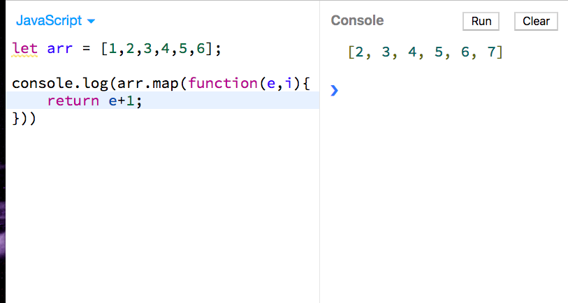
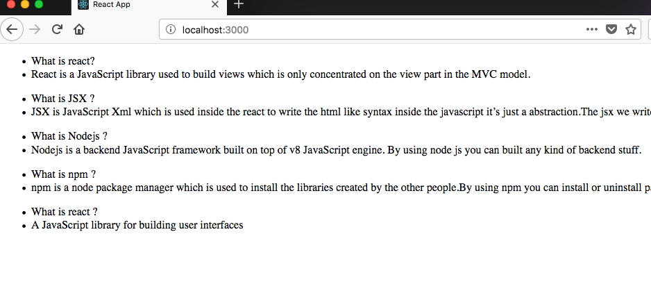
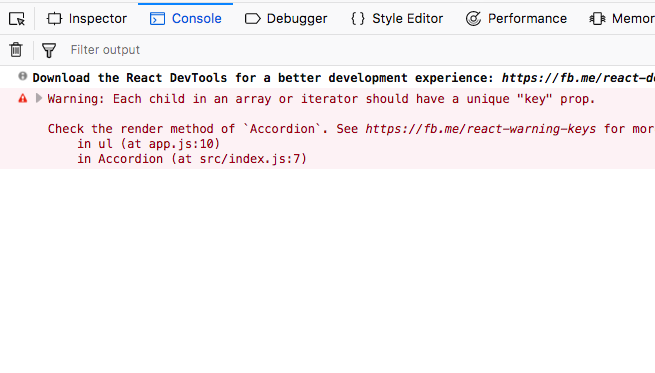
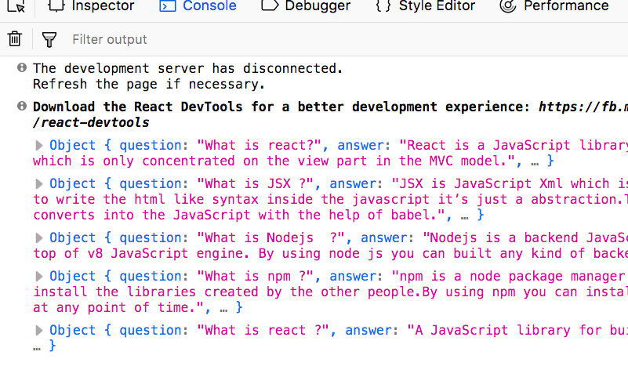

## Components

Components are the reusable pieces of code which often you can easily composable with other components.

In react they are two approaches to write components one is functional components other is es6 class
based components.

If you don't know about es6 classes then  checkout <a href="https://developer.mozilla.org/en-US/docs/Web/JavaScript/Reference/Classes" target="_blank" rel="noopner norefer">Es6 classes documentation</a>

we already created an index.js file now create the app.js file

Accordion is a class based component.

```javascript
import React from 'react';

class Accordion extends React.Component {
    render() {
        return (
            <div>
             Accordion goes here
            </div>
        );
    }
}

export default Accordion;
```

In our index.js we need to import the  Accordion component.

```javascript
import React from 'react';
import ReactDOM from 'react-dom';
import Accordion from './app';

ReactDOM.render(<Accordion/>,document.getElementById('root'))
```

Now create a new file in the src folder qa.js which are question and answers we need to use in the
accordion.

*qa.js*
```javascript
const qa = [
  {
    question: "What is react?",
    answer:
      "React is a JavaScript library used to build views which are mainly concentrated on the view part in the MVC model."
  },
  {
    question: "What is JSX ?",
    answer:
      "JSX is JavaScript XML which is used inside the react to write the HTML like syntax inside the javascript it’s just an preprocessor. The jsx we write later converts into the JavaScript with the help of babel."
  },
  {
    question: "What is Nodejs  ?",
    answer:
      "Nodejs is a backend JavaScript framework built on top of v8 JavaScript engine. By using node js you can be built any kind of backend stuff."
  },
  {
    question: "What is npm ?",
    answer:
      "npm is a node package manager which is used to install the libraries created by the other people. By using npm you can install or uninstall packages at any point in time."
  },
  {
    question: "What is react ?",
    answer: "A JavaScript library for building user interfaces"
  }
];

export default qa;
```

Now import the qa array to the app.js file

*app.js file*

```javascript
import React from "react";
import qa from "./qa";

class Accordion extends React.Component {
  render() {
    return (
      <div>
         Accordion goes here
      </div>
    );
  }
}

export default Accordion;
```

### Es6 Map method

Now we are using es6 map method which is used to transform the old array and returning the new array back instead of mutating the old array.

map method takes the callback function as the argument and also it passes the two parameters to the
callback function which is element and index.

```javascript
let arr = [1,2,3,4,5,6];

arr.map(function(e,i){
    return e+1;
})

```



In jsx JavaScript expressions must be written inside the curly braces { } so that in below accordion component we used curly braces to loop over through the qa array and created the ul elements for each pair.

*app.js file*

```javascript
import React from "react";
import qa from "./qa";

class Accordion extends React.Component {
  render() {
    return (
      <div>
         {qa.map(function(e, i) {
          return (
            <ul>
              <li>{e.question}</li>
              <li>{e.answer}</li>
            </ul>
          );
        })}
      </div>
    );
  }
}

export default Accordion;
```
If you run npm start you will see.



If you open console you will see an error like this Each child in an array or iterator should have a unique "key" prop.



### Keys
This error due to keys  because react needs to track the changes of that nested ul element in the dom
so that we need to add a key prop to the ul element.

*app.js file*

```javascript
import React from "react";
import qa from "./qa";

class Accordion extends React.Component {
  render() {
    return (
      <div>
         {qa.map(function(e, i) {
          return (
            <ul key={i}>
              <li>{e.question}</li>
              <li>{e.answer}</li>
            </ul>
          );
        })}
      </div>
    );
  }
}

export default Accordion;
```
If you check it now the error is disappeared.

Now it's time to build a new composable component for the question and answers.

create a *list.js* file.

```javascript
import React from "react";

function List(props) {
  return (
    <ul>
      <li>{props.question}</li>
      <li>{props.answer}</li>
    </ul>
  );
}

export default List;
```

### What is Props?

- Props help to pass the data to the child components.
- Props are immutable.
- we need to declare props using props.nameoftheprop.
- In functional components react passes  props as the first parameter to the function.

Now let's see how can we pass the data to the props.question and props.answer.


Import the list component into the app.js
*app.js*

```javascript
import React from "react";
import qa from "./qa";
import List from "./list";

class Accordion extends React.Component {
  render() {
    return (
      <div>
        {qa.map(function(e, i) {
          return <List question={e.question} answer={e.answer} key={i} />;
        })}
      </div>
    );
  }
}

export default Accordion;
```
Does it make any sense we declared two props in a list.js file which are props.question and props.answer?
we pass the data using the name of that prop.

if you console.log the props in the list component you will see five objects.




