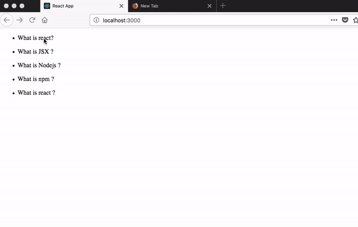

## Event handling

In normal HTML5 we are using an onclick but in react we need to use the camelCase notation onClick.

We need to attach the onClick event handler to the li question element so that we only show the answer when a user clicks on the question at the end this tutorial we need to implement this feature to our accordion app.

*list.js*

```javascript
import React from "react";

function List(props) {
  return (
    <ul>
      <li onClick={props.handleChange}>{props.question}</li>
      <li>{props.answer}</li>
    </ul>
  );
}

export default List;
```

we declared props.handleChange now we need to pass the data to that prop.

we are using the arrow functions to resolve this keyword issue.

*app.js*

```javascript
import React from "react";
import qa from "./qa";
import List from "./list";

class Accordion extends React.Component {

  handleChange = () => {
    console.log(true);
  };

  render() {
    const { handleChange } = this;

    return (
      <div>
        {qa.map(function(e, i) {
          return (
            <List
              question={e.question}
              answer={e.answer}
              handleChange={handleChange}
              key={i}
            />
          );
        })}
      </div>
    );
  }
}

export default Accordion;
```

Now if you click on the question you will see true is logged in your console.

## State

- A state is an object in react which helps us to show the users where they are currently in like making the navigation active and fetch the related posts.

- In react we only use state in class-based components there is no state in the functional components.

- The state is mutable.

Let's implement a state in our accordion app.

we initialized a state with one property currentIndex  and destructured it using es6 destructuring.

*app.js*
```javascript
import React from "react";
import qa from "./qa";
import List from "./list";

class Accordion extends React.Component {

  state = {
    currentIndex: -1,
  }

  handleChange = () => {
    console.log(true);
  };

  render() {

    const { handleChange } = this;
    const { index} = this.state;

    return (
      <div>
        {qa.map(function(e, i) {
          return (
            <List
              question={e.question}
              answer={e.answer}
              handleChange={handleChange}
              key={i}
            />
          );
        })}
      </div>
    );
  }
}

export default Accordion;

```

Now we need to update the  currentIndex property in the state to the user currently clicked index.

### How to update the state in react?

To update the state in the react we need to use the **this.setState**  method which is provided by the react.

we are adding a new parameter **i** to the handleChange arrow function.


*app.js*
```javascript
import React from "react";
import qa from "./qa";
import List from "./list";

class Accordion extends React.Component {

  state = {
    currentIndex: -1
  };

  handleChange = (i) => {
    this.setState({
      index:i
    })
  };

  render() {

    const { handleChange } = this;
    const { currentIndex } = this.state;

    return (
      <div>
        {qa.map(function(e, i) {
          return (
            <List
              question={e.question}
              answer={e.answer}
              handleChange={handleChange}
              key={i}
              index={i}
            />
          );
        })}
      </div>
    );
  }
}

export default Accordion;

```

we need to pass the index data to the list component by using props.

*list.js*

```javascript
import React from "react";

function List(props) {
  return (
    <ul>
      <li onClick={()=>props.handleChange(props.index)}>{props.question}</li>
      <li>{props.answer}</li>
    </ul>
  );
}

export default List;
```

### Conditional Rendering

Conditional rendering means we only show the answer when a user clicks on the question otherwise we don't need to show.

Now we are adding a new prop to the List component which is currentIndex.

*app.js*

```javascript
import React from "react";
import qa from "./qa";
import List from "./list";

class Accordion extends React.Component {
  state = {
    currentIndex: -1
  };

  handleChange = i => {
    this.setState({
      currentIndex: i
    });
  };

  render() {
    const { handleChange } = this;
    const { currentIndex} = this.state;

    return (
      <div>
        {qa.map(function(e, i) {
          return (
            <List
              question={e.question}
              answer={e.answer}
              handleChange={handleChange}
              key={i}
              index={i}
              currentIndex={currentIndex}
            />
          );
        })}
      </div>
    );
  }
}

export default Accordion;

```

We added a `{props.currentIndex === props.index && <li>{props.answer}</li>}` so that the answer element only
shows in the browser when this condition is true.

*list.js*
```javascript
import React from "react";

function List(props) {
  return (
    <ul>
      <li onClick={() => props.handleChange(props.index)}>{props.question}</li>
      {props.currentIndex === props.index && <li>{props.answer}</li>}
    </ul>
  );
}

export default List;
```

Let's check it now



