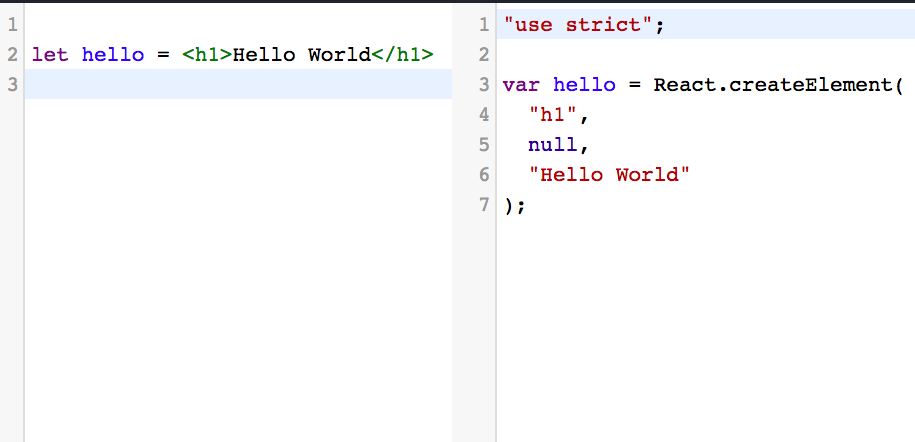

## What is  JSX?

JSX means JavaScript XML which is used in the react to write the HTML like syntax inside the
javascript it's just an preprocessor.The jsx we write later converts into the JavaScript with the
help of Babel.

```javascript
let hello = <h1>Hello World</h1>
```
When it runs through the babel it converts into

```javascript
var hello = React.createElement(
  "h1",
  null,
  "Hello World"
);
```




## Virtual Dom

- Virtual dom means, not a real dom.

- React uses the Virtual dom behind the scenes to create and mutate the real dom elements based on the virtual dom object.

