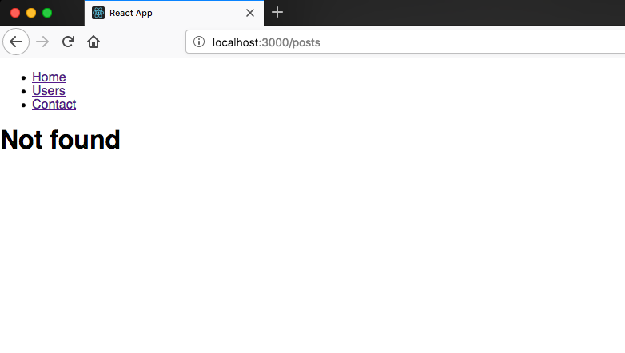

## What is a 404 page?

A 404 page is also called not found page it means when a user navigates to the wrong path that doesn't present in the website we need to show the not found page.

## How to add a 404 page in react?

we need to import another component called Switch which is provided by the react router.

### What is Switch?

Switch component helps us to render the components only when path matches otherwise it fallbacks to the not found component.

let's create a Not found component.

_notfound.js_

```javascript
import React from 'react'

const Notfound = () => <h1>Not found</h1>

export default Notfound
```

_index.js_

```javascript
import React from 'react'
import ReactDOM from 'react-dom'
import './index.css'
import { Route, Link, BrowserRouter as Router, Switch } from 'react-router-dom'
import App from './App'
import Users from './users'
import Contact from './contact'
import Notfound from './notfound'

const routing = (
  <Router>
    <div>
      <ul>
        <li>
          <Link to="/">Home</Link>
        </li>
        <li>
          <Link to="/users">Users</Link>
        </li>
        <li>
          <Link to="/contact">Contact</Link>
        </li>
      </ul>
      <Switch>
        <Route exact path="/" component={App} />
        <Route path="/users" component={Users} />
        <Route path="/contact" component={Contact} />
        <Route component={Notfound} />
      </Switch>
    </div>
  </Router>
)

ReactDOM.render(routing, document.getElementById('root'))
```

Let's check it now by manually entering wrong path _localhost:3000/posts_.


