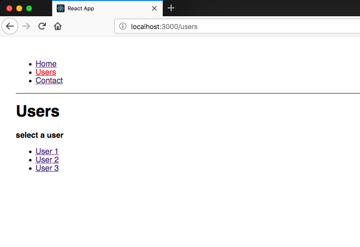

## NavLink

It is used to style the active routes so that user knows on which page he or she is currently browsing on the website.

## What is the difference between NavLink and Link?

The `Link` component is used to navigate the different routes on the site. But `NavLink` is used to add the style attributes to the active routes.

In our routing app, we have three routes which are [home, /users, /contact] Let's style them using NavLink.

We need to add a new prop called `activeClassName` to the NavLink component so that it applies that class whenever the route it is active.

_index.css_

```css
.active{
  color:red;
}
```


_index.js_

```js
import React from 'react'
import ReactDOM from 'react-dom'
import './index.css'
import {
  Route,
  NavLink,
  BrowserRouter as Router,
  Switch,
} from 'react-router-dom'
import App from './App'
import Users from './users'
import Contact from './contact'
import Notfound from './notfound'

const routing = (
  <Router>
    <div>
      <ul>
        <li>
          <NavLink exact activeClassName="active" to="/">
            Home
          </NavLink>
        </li>
        <li>
          <NavLink activeClassName="active" to="/users">
            Users
          </NavLink>
        </li>
        <li>
          <NavLink activeClassName="active" to="/contact">
            Contact
          </NavLink>
        </li>
      </ul>
      <hr />
      <Switch>
        <Route exact path="/" component={App} />
        <Route path="/users" component={Users} />
        <Route path="/contact" component={Contact} />
        <Route component={Notfound} />
      </Switch>
    </div>
  </Router>
)

ReactDOM.render(routing, document.getElementById('root'))
```

Now you can see a red color is applied to the active routes.


